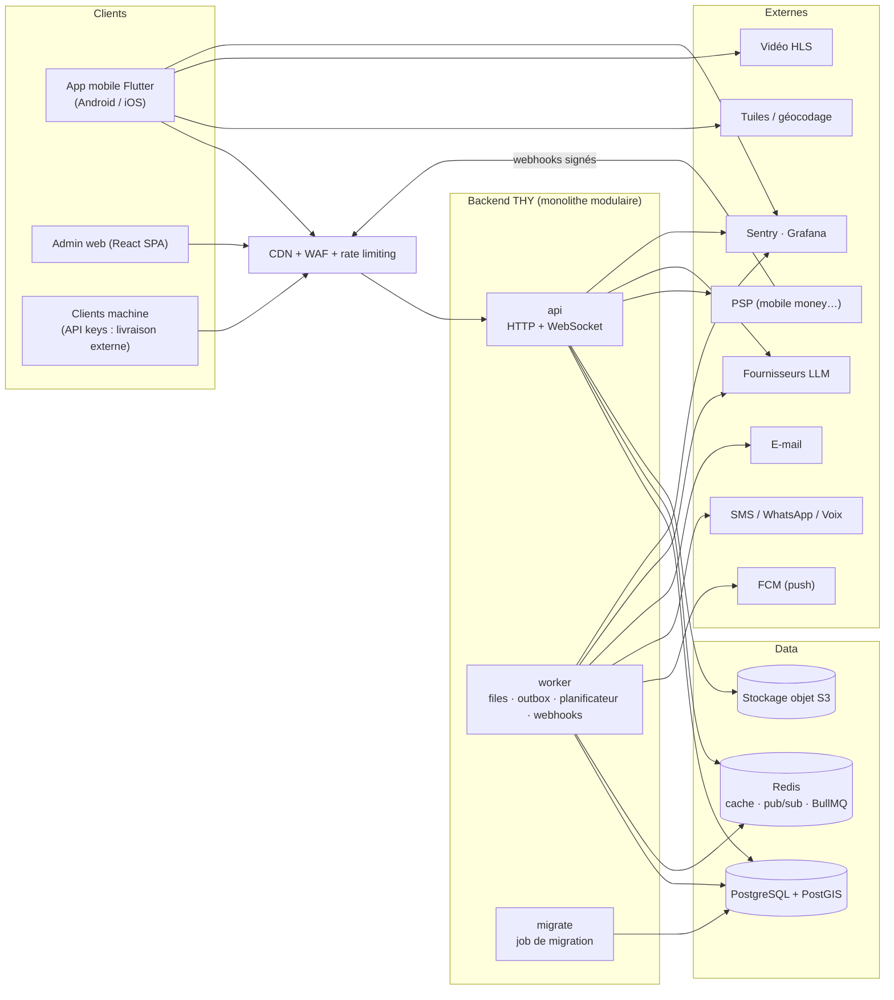
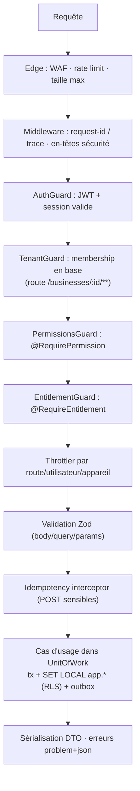
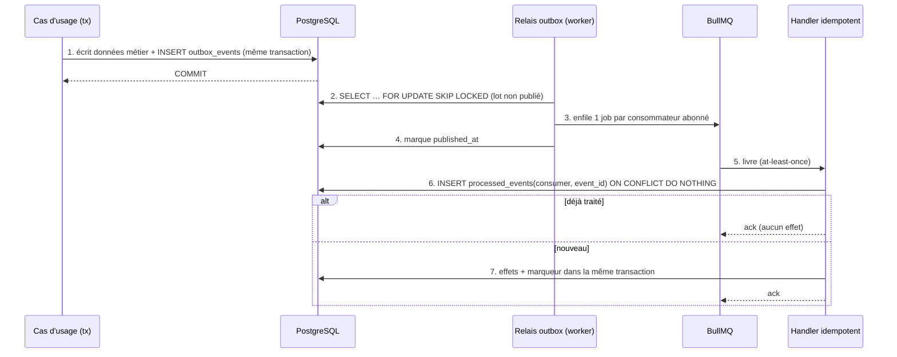
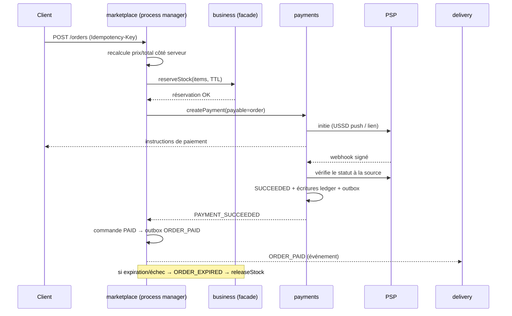
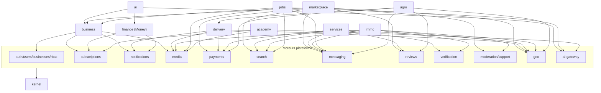

# 02 — Architecture globale, backend, frontend, événements, dépendances

Couvre les points 1, 2, 3 et 25 du blueprint.

---

## 1. Vue d'ensemble (contexte système)



**Propriétés clés**

- L'`api` est **sans état** (scalable horizontalement) ; l'état vit dans PG/Redis/S3.
- Le `worker` exécute tout ce qui est asynchrone ou planifié ; il partage le code des modules mais **pas** le trafic HTTP.
- Un seul **leader** exécute les tâches planifiées (verrou consultatif PG/Redis).
- Les webhooks entrants sont **enregistrés d'abord**, traités ensuite (§ [06 §1](06-platform-engines.md)).

---

## 2. Modèle en couches et règles de dépendance

```
 Tier 3  Modules métier      business  marketplace  services  delivery  immo  jobs  academy  agro  finance  ai
            │  (jamais entre eux, sauf flèche déclarée §8)
 Tier 2  Moteurs plateforme  auth users businesses rbac subscriptions payments notifications messaging
            │                search reviews verification moderation media geo engagement audit support
 Tier 1  Kernel              config · database(tx, tenant ctx, RLS) · events · queue · cache · http · security
                             observability · storage · i18n · testing
```

**Règles (vérifiées en CI par `dependency-cruiser` + tests d'architecture)**

| #   | Règle                                                                                                                                              |
| --- | -------------------------------------------------------------------------------------------------------------------------------------------------- |
| R1  | Un tier ne dépend que des tiers **inférieurs** (ou de lui-même).                                                                                   |
| R2  | Un module n'importe d'un autre module **que** `@thy/<module>/contracts` (facade, DTO, schémas d'événements).                                       |
| R3  | Deux **modules métier** (tier 3) ne s'appellent **jamais** directement, sauf dépendance déclarée §8 ; sinon → **événement**.                       |
| R4  | Le **kernel** ne contient aucune logique métier ni connaissance d'un module.                                                                       |
| R5  | Un module n'écrit que dans **son schéma PG** ; les lectures inter-schémas passent par la facade (exceptions listées dans [03 §6](03-database.md)). |
| R6  | Les modules **ne connaissent pas** leurs consommateurs d'événements.                                                                               |
| R7  | Aucun `import` de `infrastructure/` depuis l'extérieur du module.                                                                                  |

---

## 3. Carte des modules et moteurs

| Tier | Module          | Responsabilité                                                                           | Phase               |
| ---- | --------------- | ---------------------------------------------------------------------------------------- | ------------------- |
| 1    | `kernel/*`      | Fondations techniques transverses                                                        | 0                   |
| 2    | `auth`          | OTP, mots de passe, JWT, sessions, appareils, récupération                               | 0                   |
| 2    | `users`         | Compte, profil, personas, consentements                                                  | 0                   |
| 2    | `businesses`    | Entreprises, lieux, membres, invitations                                                 | 0                   |
| 2    | `rbac`          | Rôles, permissions, évaluation, cache                                                    | 0                   |
| 2    | `subscriptions` | Plans, entitlements, quotas, flags                                                       | 0 (squelette) → 1   |
| 2    | `notifications` | Push/SMS/e-mail/in-app, préférences, gabarits                                            | 0 (base) → 1        |
| 2    | `media`         | Upload signé, scan, variantes, liens                                                     | 0                   |
| 2    | `audit`         | Journal append-only                                                                      | 0                   |
| 2    | `payments`      | `PaymentProvider`, machine d'états, grand livre, remboursements, paiements sortants      | 1 (abonnements) → 3 |
| 2    | `search`        | Index global + moteurs par module                                                        | 3                   |
| 2    | `messaging`     | Conversations, messages, blocages                                                        | 3                   |
| 2    | `reviews`       | Avis liés à une interaction réelle                                                       | 3                   |
| 2    | `verification`  | Vérifications KYC/entreprise/pro                                                         | 3                   |
| 2    | `moderation`    | Signalements, files, décisions, litiges                                                  | 3                   |
| 2    | `geo`           | Adresses, zones, `GeoProvider`                                                           | 3–4                 |
| 2    | `engagement`    | Favoris, recherches sauvegardées/alertes                                                 | 3                   |
| 2    | `support`       | Tickets, litiges                                                                         | 3                   |
| 2    | `ai-gateway`    | Abstraction LLM, quotas, journal                                                         | 2                   |
| 3    | `business`      | Caisse, ventes, produits, stock, achats, contacts, crédits, dépenses, employés, rapports | 1                   |
| 3    | `ai`            | Assistant, outils, pipeline, vision                                                      | 2, 10               |
| 3    | `marketplace`   | Boutiques, listings, panier, commandes                                                   | 3                   |
| 3    | `delivery`      | Livreurs, missions, suivi, preuve, API externe                                           | 4                   |
| 3    | `services`      | Prestataires, devis, réservations                                                        | 5                   |
| 3    | `immo`          | Biens, annonces, visites                                                                 | 6                   |
| 3    | `jobs`          | CV, offres, candidatures, alertes                                                        | 7                   |
| 3    | `agro`          | Producteurs, offres, commandes, fret                                                     | 8                   |
| 3    | `finance`       | THY Money : comptes perso, budgets, objectifs                                            | 9                   |
| 3    | `academy`       | Cours, quiz, progression, hors-ligne                                                     | 10                  |

> Le brief listait `/roles`, `/permissions`, `/products`, `/orders`, `/payments` comme modules plats. Ici : `rbac` regroupe rôles+permissions ; produits/stock/commandes POS vivent dans `business`, commandes en ligne dans `marketplace`, `payments` est un moteur.

---

## 4. Topologie d'exécution

| Processus          | Rôle                                                                                                                             | Scaling                | Notes                                                        |
| ------------------ | -------------------------------------------------------------------------------------------------------------------------------- | ---------------------- | ------------------------------------------------------------ |
| `api`              | HTTP REST, WebSocket, SSE (IA)                                                                                                   | Horizontal (sans état) | WS multi-instances via adaptateur Redis                      |
| `worker`           | Relais outbox, consommateurs, jobs (notifications, index, IA longue), planificateur, webhooks entrants, réconciliation paiements | Horizontal par file    | Concurrence configurée par file ; verrou leader pour le cron |
| `migrate`          | Applique les migrations **avant** le déploiement de l'`api`                                                                      | Ponctuel               | Jamais au démarrage de l'API                                 |
| `admin` (statique) | SPA derrière CDN                                                                                                                 | CDN                    | Parle à `/admin/v1`                                          |

Extraction future : un `worker` peut être spécialisé (`worker-ai`, `worker-tracking`) par simple variable de configuration listant les files consommées.

---

## 5. Architecture backend détaillée

### 5.1 Anatomie d'un module

```
modules/<name>/
  <name>.module.ts
  contracts/          ← SEUL point d'import externe : facade interface, DTO publics, schémas d'événements
  api/                ← contrôleurs, gateways WS, schémas Zod d'entrée/sortie, mappers
  application/        ← cas d'usage (commands/queries), handlers d'événements, process managers
  domain/             ← entités, value objects, politiques, machines d'états, événements de domaine
  infrastructure/     ← repositories Drizzle, tables (schéma PG du module), adaptateurs externes
  testing/            ← factories, fixtures, fakes
```

- **Commandes vs requêtes (CQRS léger)** : les commandes passent par le domaine et l'`UnitOfWork` ; les requêtes de lecture peuvent utiliser du SQL direct optimisé (projections) **dans le même module**.
- **Ports & adaptateurs** : toute dépendance externe (PSP, SMS, LLM, stockage, géo) est un **port** dans `domain/` ou le kernel, implémenté par un adaptateur remplaçable.
- **Pas d'entités ORM exposées** : l'API renvoie des DTO explicites (pas de fuite de colonnes).

### 5.2 Pipeline d'une requête



- Le **contexte** (`Principal`, `TenantContext`, `requestId`) circule par `AsyncLocalStorage` ; les repositories exigent un `TenantContext` explicite pour les tables tenant.
- **Test d'architecture « registre de routes »** : chaque route doit déclarer explicitement `@Public()` **ou** une politique (permission/propriété). Une route sans déclaration fait échouer la CI.
- **Le serveur recalcule tout** : prix, totaux, taxes, statut de paiement, éligibilité — jamais repris du client.

### 5.3 Gestion des erreurs

- Hiérarchie : `DomainError` (règle métier, 4xx) → `AppError` (validation, autorisation) → erreurs techniques (5xx, journalisées, jamais détaillées au client).
- Chaque erreur métier a un **`code` stable** (`STOCK_INSUFFICIENT`, `PAYMENT_EXPIRED`) traduit côté client.
- Aucune erreur avalée : erreur non gérée ⇒ log structuré + Sentry + réponse générique avec `traceId`.

### 5.4 Configuration et secrets

- Configuration **typée et validée au démarrage** (Zod) : le processus **refuse de démarrer** si une variable manque ou si un provider « sandbox » est activé en production.
- Secrets uniquement via gestionnaire de secrets de l'environnement ; jamais dans le dépôt, jamais dans les logs.

### 5.5 Application des frontières

- `dependency-cruiser` (règles R1–R7) + `eslint-plugin-boundaries` en CI.
- Tests d'architecture (`ts-arch`-like) : aucun import vers `infrastructure/` externe ; aucun module tier 3 → tier 3 hors matrice §8.
- Revue obligatoire (CODEOWNERS) sur `contracts/` : c'est l'API publique interne.

---

## 6. Architecture événementielle

### 6.1 Enveloppe d'événement

```json
{
  "event_id": "018f…(uuidv7)",
  "type": "SALE_COMPLETED",
  "version": 1,
  "occurred_at": "2026-09-21T10:15:00Z",
  "producer": "business",
  "business_id": "…",
  "actor": { "user_id": "…", "kind": "USER|SYSTEM|STAFF" },
  "correlation_id": "…",
  "causation_id": "…",
  "payload": {}
}
```

Nommage : `SUJET_PARTICIPE_PASSÉ` (`ORDER_CREATED`), schémas Zod dans `contracts/events/`, **évolution additive** ; changement cassant ⇒ `version` + N-1 supporté un cycle de release.

### 6.2 Flux outbox → consommateurs



- **At-least-once + idempotence** : clé `(consumer, event_id)` unique. Pour les effets externes (push, SMS) : clé d'idempotence = `event_id + dedupe_key`.
- **Ordre** : non supposé. Les consommateurs sont **commutatifs** ou vérifient `aggregate_version`. Ordre requis ⇒ file partitionnée par `hash(aggregate_id)` à concurrence 1.
- **Échecs** : backoff exponentiel → **DLQ** consultable/rejouable depuis l'admin ; alerte dès qu'une DLQ est non vide.
- **Latence cible** : p95 publication < 5 s.

### 6.3 Règle de cohérence

| Situation                                                       | Mécanisme                                                               |
| --------------------------------------------------------------- | ----------------------------------------------------------------------- |
| Invariant intra-module (vente ↔ stock ↔ crédit client)          | **Même transaction** ACID                                               |
| Effet inter-modules (notification, stats, index, livraison, IA) | **Événement**                                                           |
| Flux multi-étapes avec compensation (checkout)                  | **Process manager** persistant dans le module propriétaire de l'agrégat |

> Écart avec l'exemple du brief : la diminution du stock **n'est pas** déclenchée par `SALE_COMPLETED`, elle fait partie de la transaction de vente. `SALE_COMPLETED` déclenche stats, alertes stock bas, index, recommandations.

### 6.4 Catalogue initial

| Événement                                           | Producteur    | Consommateurs                                                          |
| --------------------------------------------------- | ------------- | ---------------------------------------------------------------------- |
| `USER_REGISTERED`                                   | users         | notifications (bienvenue), analytics                                   |
| `BUSINESS_CREATED`                                  | businesses    | subscriptions (plan FREE), rbac (rôles par défaut), analytics          |
| `MEMBER_ROLE_CHANGED`                               | businesses    | rbac (invalidation cache), audit                                       |
| `PRODUCT_UPDATED`                                   | business      | marketplace (listings liés), search                                    |
| `SALE_COMPLETED`                                    | business      | reports, notifications, analytics, ai (cache)                          |
| `STOCK_LOW`                                         | business      | notifications, ai                                                      |
| `LISTING_PUBLISHED / UNPUBLISHED`                   | marketplace   | search, notifications                                                  |
| `ORDER_CREATED`                                     | marketplace   | notifications (vendeur, client), analytics                             |
| `PAYMENT_SUCCEEDED / FAILED / EXPIRED / REFUNDED`   | payments      | marketplace, services, agro, subscriptions, notifications              |
| `ORDER_PAID`                                        | marketplace   | delivery (création), business (vente canal MARKETPLACE), notifications |
| `DELIVERY_CREATED … DELIVERED / FAILED / CANCELLED` | delivery      | marketplace/agro (statut), notifications, reviews (éligibilité)        |
| `VERIFICATION_APPROVED / REJECTED`                  | verification  | subject module, notifications, search                                  |
| `REPORT_SUBMITTED`, `MODERATION_ACTION_TAKEN`       | moderation    | modules concernés, notifications, audit                                |
| `SUBSCRIPTION_CHANGED`                              | subscriptions | rbac/cache entitlements, notifications                                 |
| `BOOKING_CONFIRMED / COMPLETED`                     | services      | notifications, reviews, payments                                       |
| `JOB_APPLICATION_SUBMITTED`                         | jobs          | notifications, ai (optionnel)                                          |
| `PROPERTY_LISTING_VERIFIED`                         | immo          | search, notifications                                                  |

### 6.5 Exemple : checkout Marketplace (process manager)



---

## 7. Architecture frontend (Flutter)

### 7.1 Principes

1. **Une app, un shell**, des **modules enregistrés** ; ajouter un module ne modifie pas le shell.
2. **Feature-first + packages Melos** : frontières compilées, builds parallélisables.
3. **Toute lecture réseau passe par un repository** ; l'UI ne connaît ni HTTP ni SQL.
4. **Offline-capable par défaut** pour les données critiques (voir [08](08-offline-sync.md)).
5. **Aucune règle métier sensible côté client** (le client affiche, propose, met en file — le serveur décide).

### 7.2 Packages

```
mobile/
  app/                     shell : flavors, bootstrap, ModuleRegistry, router, navigation, accueil
  packages/
    thy_core/              réseau, session/auth, stockage sécurisé, erreurs, logs, config, flags, entitlements
    thy_design_system/     tokens, thèmes clair/sombre, composants, icônes, graphiques
    thy_api/               client généré depuis OpenAPI + DTO
    thy_sync/              abstraction base locale, file de commandes, résolution de conflits
    thy_l10n/              ARB fr/en, formateurs (argent, dates, nombres)
    thy_engines/           UI des moteurs : chat, avis, sélecteur média, carte, inbox notifications, badge vérification, recherche
    features/
      account/  home/  business/  marketplace/  services/  delivery/
      immo/  jobs/  academy/  agro/  money/  ai/
```

Structure interne d'un package feature :
`lib/src/{presentation, application, domain, data}` + `lib/<feature>.dart` exportant `XModule`.

### 7.3 Contrat de module

```dart
abstract class ThyModule {
  String get id;                        // 'business'
  ModuleGate get gate;                  // flag serveur + entitlement + persona suggérée + pays
  List<RouteBase> get routes;           // routes propres au module
  NavCandidate? get navCandidate;       // éligible à un emplacement de barre de navigation
  List<HomeWidgetSpec> get homeWidgets; // cartes contribuées à l'accueil
  List<SearchScope> get searchScopes;   // participation à la recherche globale
  List<QuickAction> get quickActions;   // raccourcis (« Nouvelle vente »)
  void registerProviders(ProviderRegistry r);
}
```

### 7.4 Navigation adaptative

- **5 emplacements** : `Accueil` (fixe) · **3 emplacements dynamiques** · `Plus` (fixe, grille de tous les modules actifs).
- Défaut conforme au brief : Marketplace · Services · Business. Le `NavigationPolicy` reclasse selon **personas actives + usage récent + module activé pour le pays**, avec **épinglage manuel** par l'utilisateur.
- Source de vérité : `GET /me/app-config` (modules activés, ordre, flags, version minimale) — mis en cache, avec valeur par défaut embarquée si hors-ligne.
- **Aucun écran dupliqué** : profil, notifications, messagerie, paiement, avis, médias, carte vivent dans `thy_engines`/`account` et sont montés par tous les modules.
- Deep links : `https://app.thy…/m/<module>/…` + schéma `thy://` ; routes déclaratives typées (`go_router`).

### 7.5 Accueil (Dashboard THY)

- Liste de `HomeWidgetSpec` contribuées par les modules, **triée** par (préférences utilisateur → personas → pertinence) et **filtrée** (flags, entitlements, pays).
- Personnalisation : réordonner/masquer, stockée dans `user_preferences.home_layout`, synchronisée.
- Chaque carte charge **indépendamment** (squelette → données → erreur locale) : une carte lente ou en erreur ne bloque pas l'écran.
- Sections types : « Votre activité aujourd'hui » (Business), commandes en cours, livraison en cours, budget du mois, recommandations, assistant IA.

### 7.6 État, réseau, données

| Sujet    | Décision                                                                                                                                                           |
| -------- | ------------------------------------------------------------------------------------------------------------------------------------------------------------------ |
| État     | Riverpod (providers `AsyncNotifier`), immutabilité via freezed                                                                                                     |
| Réseau   | Dio ; intercepteurs : auth (refresh **single-flight**), `Idempotency-Key`, `X-App-Version`, `X-Request-Id`, ETag, retry/backoff GET ; timeouts courts + annulation |
| Cache    | Stale-while-revalidate ; TTL par ressource ; invalidations par événements WS/push                                                                                  |
| Local DB | Drift + SQLCipher ; clé dans Keystore/Keychain ; purge à la déconnexion                                                                                            |
| Modèles  | DTO générés → modèles de domaine (mappers explicites)                                                                                                              |
| Erreurs  | `code` serveur → message localisé ; état « hors-ligne » distinct de « erreur »                                                                                     |
| Média    | Miniatures WebP/AVIF serveur, cache disque borné, chargement paresseux                                                                                             |

### 7.7 Design system (structure — palette à fournir, D10)

- **Couches de tokens** : _primitifs_ (échelles brutes) → _sémantiques_ (`surface`, `onSurface`, `primary`, `danger`, `success`…) → _composants_. Le mode sombre ne redéfinit que les sémantiques.
- **Source unique JSON** → génération `ThemeExtension` Flutter + variables CSS admin (Style Dictionary).
- **Échelles** : espacement 4/8 pt, rayons (`xs…full`), élévations, typographie (1 police variable sous-ensemble, tailles relatives pour l'accessibilité), durées de mouvement.
- **Accent par module** (une teinte d'accent chacun, même socle neutre) : cohérence + repérage.
- **Composants livrés en Phase 0** : boutons (primaire/secondaire/texte/danger, états), champs (texte, téléphone, OTP, montant, recherche), cartes, listes, modales/bottom sheets, badges (dont **badge de vérification**), alertes/bannières (dont **hors-ligne**), navigation, tableaux compacts, graphiques (ligne/barre/anneau), **états vides / chargement (squelettes) / erreur**, toasts, formulaires par étapes.
- **Accessibilité** : contraste AA (4,5:1), cibles ≥ 48 dp, échelle de texte système jusqu'à 200 %, sémantique lecteur d'écran, pas d'information portée par la couleur seule.
- **Outillage** : galerie **Widgetbook**, tests **golden** clair/sombre, lint interdisant les couleurs/espacements « en dur ».

### 7.8 Internationalisation et format

- ARB (`fr` défaut, `en`), clés par module ; test CI de clés manquantes.
- **Aucun symbole/décimales de devise en dur** : `MoneyFormatter(currencyCode, minorUnits)` alimenté par `core.currencies`.
- Dates : stockage UTC ; affichage par fuseau utilisateur/business ; formats via `intl`. Téléphones : `libphonenumber`.
- Messages d'erreur serveur : `code` → traduction locale.

### 7.9 Sécurité côté client (MASVS)

Stockage sécurisé (Keychain/Keystore) pour refresh token + clé SQLCipher ; déverrouillage biométrique **local uniquement** (jamais transmis) ; obfuscation Dart (`--obfuscate --split-debug-info`) ; **aucune clé secrète** (LLM, PSP) dans l'app ; Play Integrity / App Attest sur endpoints sensibles (OTP, inscription) ; masquage d'écran sur écrans financiers ; épinglage de certificat **optionnel** (avec plan de rotation) ; détection root/jailbreak = signal de risque, pas blocage aveugle.

### 7.10 Budgets de performance (appareil cible : Android 2 Go RAM, entrée de gamme)

| Métrique                               | Budget                                          |
| -------------------------------------- | ----------------------------------------------- |
| Démarrage à froid → écran interactif   | < 2,5 s                                         |
| Taille de téléchargement (AAB par ABI) | < 40 Mo (modules lourds en composants différés) |
| Liste : temps de frame                 | 60 fps, pas de jank > 16 ms sur défilement      |
| Page de liste API                      | ≤ 50 Ko compressés, 20 éléments                 |
| Miniature liste                        | ≤ 40 Ko                                         |
| Mémoire pic                            | < 300 Mo                                        |

---

## 8. Dépendances entre modules

### 8.1 Graphe (flèche = « dépend de / appelle la facade de »)



### 8.2 Matrice de dépendances autorisées entre modules métier (tier 3)

| Appelant ↓ / Appelé → | business                                | delivery                  | ai             | finance                       |
| --------------------- | --------------------------------------- | ------------------------- | -------------- | ----------------------------- |
| marketplace           | ✅ facade (produits, réservation stock) | via événements            | —              | —                             |
| ai                    | ✅ facade (outils, lecture seule)       | —                         | —              | ✅ facade (avec consentement) |
| jobs                  | ✅ facade (identité employeur)          | —                         | via ai-gateway | —                             |
| agro                  | —                                       | ✅ facade (création fret) | —              | —                             |
| business              | ⟵ écoute `ORDER_PAID`, `DELIVERY_*`     | —                         | —              | —                             |

Tout ce qui n'est pas coché passe par **événement** ou est **interdit**. Une nouvelle dépendance = revue d'architecture + mise à jour de cette matrice.

### 8.3 Ordre de construction des moteurs

| Moteur                                                                                | Construit en                           | Premier consommateur |
| ------------------------------------------------------------------------------------- | -------------------------------------- | -------------------- |
| auth, users, businesses, rbac, audit, media, notifications (base), kernel             | Phase 0                                | tous                 |
| subscriptions/entitlements                                                            | Phase 0 (squelette), Phase 1 (complet) | Business             |
| payments (abonnements)                                                                | fin Phase 1                            | Business             |
| ai-gateway                                                                            | Phase 2                                | AI                   |
| search, messaging, reviews, verification, moderation, engagement, support, geo (base) | Phase 3                                | Marketplace          |
| payments (commandes, paiements sortants, séquestre)                                   | Phase 3                                | Marketplace          |
| geo (itinéraires, zones), API keys + webhooks sortants                                | Phase 4                                | Delivery             |
| vision/OCR pipeline                                                                   | Phase 10                               | Academy              |

---

## 9. Conventions transverses

- **API** : `/api/v1` ; ressources au pluriel ; verbes HTTP standard ; actions d'état par sous-ressource (`POST /orders/{id}/cancel`).
- **Base** : `snake_case`, tables au pluriel, schéma PG par module (`biz.sales`).
- **Événements** : `SCREAMING_SNAKE_CASE`, participe passé.
- **Code** : TypeScript `strict`, Dart `strict-casts`, aucun `any` implicite ; erreurs jamais ignorées.
- **Tests** : à côté du code (`*.spec.ts`), scénarios E2E dans `backend/test/e2e`.
- **Docs** : toute décision majeure ⇒ ADR ; toute API publique ⇒ OpenAPI ; toute table ⇒ documentée dans `docs/DATABASE.md` (générée).
