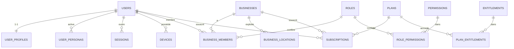
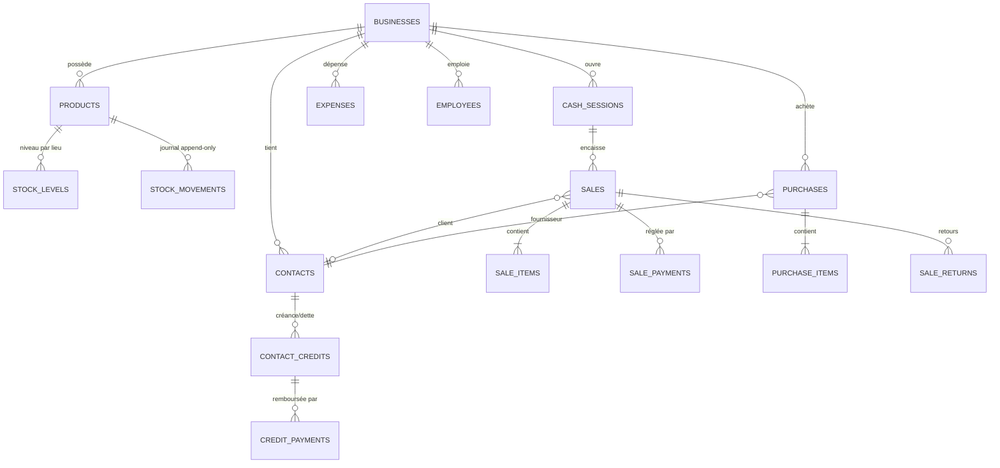
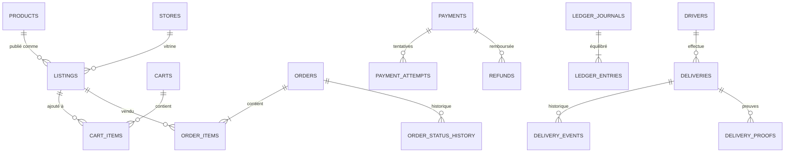
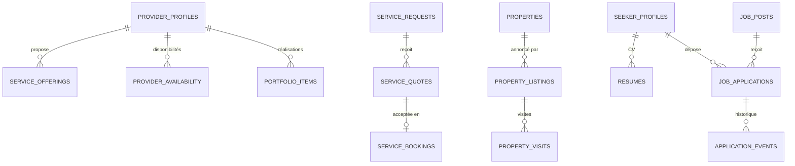
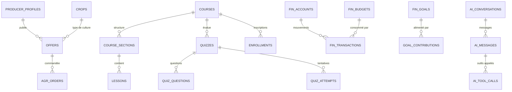
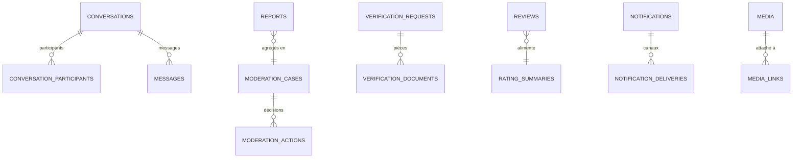

# 03 — Architecture de la base de données

Couvre les points 4, 5 et la partie DB du point 13.

---

## 1. Principes et conventions

| Sujet | Règle |
|---|---|
| Moteur | PostgreSQL (≥ 16, cible 17/18) + extensions : `postgis`, `pg_trgm`, `unaccent`, `citext`, `btree_gist` (exclusions de chevauchement), `pg_stat_statements`. `pgvector` **différé** (recherche sémantique, Phase 7+ si justifié). |
| Organisation | **Un schéma PG par module** : `core, billing, pay, biz, mkt, svc, dlv, imm, jobs, acd, agr, fin, ai, comm, trust, search, ops, analytics`. Reflète la frontière logique, facilite permissions et extraction. |
| Rôles DB | `thy_migrator` (propriétaire, DDL) · `thy_app` (DML, **NOBYPASSRLS**, non propriétaire) · `thy_readonly` (BI/replica) · `thy_admin_app` (accès staff audité). Jamais de superuser applicatif. |
| Clés primaires | `uuid` **UUIDv7** (`DEFAULT uuidv7()` ou généré côté app/client). Aucune séquence exposée. |
| Horodatage | `created_at`, `updated_at` (`timestamptz`, UTC) sur toutes les tables ; trigger d'`updated_at`. |
| Concurrence | Colonne `version integer NOT NULL DEFAULT 1` sur les entités éditables (verrou optimiste, sync). |
| Suppression | **Soft delete** (`deleted_at`) pour entités éditables ; **append-only** (aucune mise à jour/suppression) pour ventes, mouvements de stock, écritures comptables, audit. Index uniques **partiels** (`WHERE deleted_at IS NULL`). |
| Audit | `created_by`, `updated_by` (FK `core.users`) quand l'auteur importe ; historique fin via `ops.audit_logs`. |
| Énumérations | `text` + `CHECK` (ou table de référence) — **pas d'`ENUM` PG** (modification pénible). Valeurs définies dans le code partagé. |
| Argent | `BIGINT` unités mineures + `currency CHAR(3)` (ADR-016). Colonnes `*_minor`. |
| Quantités | `NUMERIC(18,3)` + `unit_id`. |
| JSONB | Uniquement pour attributs flexibles **validés** (Zod) ; jamais pour des colonnes filtrées/jointes fréquemment. |
| Géo | `geography(Point,4326)` / `geography(Polygon,4326)` + index GiST. |
| PII | Colonnes marquées (`COMMENT ON COLUMN … 'pii'`) ; catalogue de classification généré ; chiffrement applicatif (enveloppe) pour documents d'identité et numéros sensibles. |
| Partitionnement | Tables volumineuses par temps : `ops.audit_logs`, `dlv.driver_locations`, `ops.outbox_events`, `comm.messages` (si volume), `analytics.events`. |
| Références polymorphes | Autorisées **uniquement** pour les moteurs transverses (voir §7). |

---

## 2. Revue de la liste initiale (rationalisation)

Objectif du brief : *ne pas créer de tables inutilement*. Résultat : chaque nom initial est conservé, fusionné, renommé, généralisé ou déplacé.

| Nom initial | Décision | Détail / raison |
|---|---|---|
| users | **Garder** `core.users` | Identité et authentification uniquement (téléphone, e-mail, statut). |
| user_profiles | **Garder** `core.user_profiles` | Données personnelles modifiables séparées de l'identité (PII isolée). |
| businesses | **Garder** `core.businesses` (+ `business_locations`) | Un commerçant a souvent plusieurs boutiques : stock et caisses par lieu. |
| business_members | **Garder** | + `location_scope` (restriction par lieu). |
| roles, permissions | **Garder** + `role_permissions` | `scope ∈ {BUSINESS, PLATFORM}` ; rôles système + rôles personnalisés (entitlement). |
| products | **Garder** `biz.products` | Niveau **SKU** ; regroupement de variantes possible plus tard via `product_group_id` sans migration lourde. |
| categories | **Généraliser** `core.categories` | `scope` (BUSINESS_PRODUCT, MARKETPLACE, EXPENSE, SERVICE, JOB, COURSE, AGRO, PERSONAL_FINANCE) + `business_id`/`owner_user_id` nullables. Un seul arbre de catégories, pas huit tables. |
| inventory | **Renommer** `biz.stock_levels` | Quantité courante par (produit, lieu), **dérivée** des mouvements. |
| inventory_movements | **Renommer** `biz.stock_movements` | **Append-only** ; source de vérité du stock. |
| sales, sale_items | **Garder** + `sale_payments`, `sale_returns`, `cash_sessions` | La « caisse » exige des sessions (ouverture/clôture) et le multi-règlement. |
| payments | **Scinder** | `pay.payments` = paiement collecté par la plateforme via PSP ; `biz.sale_payments` = règlement **déclaré** au POS (espèces, mobile money externe…). |
| customers, suppliers | **Fusionner** `biz.contacts` | `is_customer` / `is_supplier` : un même tiers est souvent les deux ; lien optionnel vers `core.users`. |
| customer_credits, credit_payments | **Généraliser** `biz.contact_credits` (`direction` RECEIVABLE/PAYABLE) + `biz.credit_payments` | Créances clients **et** dettes fournisseurs, même mécanique. |
| purchases, purchase_items | **Garder** | Fournisseur = `contacts`. |
| expenses | **Garder** | Catégories via `core.categories`. |
| employees | **Garder** `biz.employees` | Fiche RH ; lien **optionnel** vers `business_members` (un employé n'a pas toujours un compte). |
| marketplace_listings | **Renommer** `mkt.listings` | Publication d'un produit Business **ou** annonce native (vendeur particulier). |
| marketplace_orders | **Renommer** `mkt.orders` (+ `order_items`, `order_status_history`) | Distinct de `biz.sales`. |
| service_providers | **Renommer** `svc.provider_profiles` | Individu (user) avec `business_id` optionnel. |
| service_requests / quotes / bookings | **Garder** | + `service_offerings`, `provider_availability`, `provider_service_areas`. |
| deliveries, delivery_events | **Garder** | + `drivers`, `vehicles`, `delivery_proofs`, `driver_locations`, `delivery_tariffs`, `dispatch_offers`. |
| properties, property_listings, property_visits | **Garder** | Bien (actif) séparé de l'annonce (offre + cycle de modération). |
| job_seekers | **Renommer** `jobs.seeker_profiles` | + `resumes`. |
| job_posts, job_applications | **Garder** | + `application_events`. |
| courses, lessons, quizzes, quiz_attempts | **Garder** | + `enrollments`, `lesson_progress`, `quiz_questions`, `attempt_answers`. |
| farmers | **Renommer** `agr.producer_profiles` | |
| agricultural_products | **Renommer** `agr.offers` + `agr.crops` (référentiel) | Distinguer le catalogue de cultures de l'offre d'un producteur. |
| agricultural_orders | **Renommer** `agr.orders` | |
| transporters | **Fusionner** avec `dlv.drivers` | Un transporteur agro est un livreur de type `FREIGHT`. |
| personal_accounts | **Renommer** `fin.accounts` | |
| financial_transactions | **Renommer** `fin.transactions` | Nom initial ambigu (Business/ledger). |
| budgets, savings_goals | **Garder** `fin.budgets`, `fin.goals` | |
| ai_conversations, ai_messages, ai_tool_calls | **Garder** | + `ai.usage_ledger` (coûts/quotas). |
| notifications | **Garder** | + `notification_preferences`, `notification_deliveries`, `notification_templates`. |
| subscriptions | **Garder** | + `plans`, `plan_prices`, `entitlements`, `plan_entitlements`, `entitlement_overrides`, `usage_counters`. |
| invoices | **Renommer** `billing.invoices` | Évite la collision avec les factures de vente Business. |
| audit_logs | **Garder** `ops.audit_logs` | Append-only, partitionné par mois. |
| support_tickets | **Garder** `trust.tickets` | Messages via `comm.conversations` (contexte SUPPORT). |
| media | **Garder** + `media_links` | Liaison polymorphe contrôlée. |
| devices | **Garder** | Appareil ↔ session ↔ jeton push. |
| sync_queue | **Déplacer côté client** | La file vit en SQLite mobile. Serveur : `ops.idempotency_keys`, `biz.sync_conflicts`. |

**Ajouts nécessaires (absents du brief)** : `otp_challenges`, `sessions`, `user_personas`, `user_consents`, `business_invitations`, `staff_users` (+ rôles), `countries`, `currencies`, `units`, `unit_conversions`, `addresses`, `skills`/`user_skills`, `favorites`, `saved_searches`, `carts`/`cart_items`, `stock_reservations`, `document_sequences`, `reviews`/`rating_summaries`, `verification_requests`/`documents`, `reports`/`moderation_cases`/`moderation_actions`, `disputes`, `conversations`/`participants`/`messages`/`user_blocks`, `feature_flags`, `outbox_events`/`processed_events`/`idempotency_keys`, `payment_attempts`/`provider_webhook_events`/`refunds`/`payouts`/`ledger_*`, `api_clients`/`api_keys`/`webhook_endpoints`/`webhook_deliveries`, `search.documents`, `analytics.events`.

---

## 3. Catalogue par schéma

> Créé **par phase** : ~25 tables en Phase 0–1, le reste progressivement. Les colonnes ci-dessous sont les points structurants, pas le DDL complet.

### `core` — identité, tenancy, référentiels (Phase 0)
| Table | Rôle | Contraintes / index clés |
|---|---|---|
| users | Identité | `phone_e164` unique partiel (actif) ; `status` ; `token_version` (révocation globale) |
| user_credentials | Hash mot de passe (Argon2id) optionnel | 1–1 users |
| user_profiles | Nom, avatar, langue, fuseau, pays | PII |
| user_personas | Capacités activées (CUSTOMER, SELLER, SERVICE_PROVIDER, JOB_SEEKER, RECRUITER, STUDENT, INSTRUCTOR, FARMER, DRIVER, PROPERTY_OWNER) | `UNIQUE(user_id, persona)` |
| user_consents | Consentements versionnés (analytics, marketing, IA, données financières) | horodatés, révocables |
| sessions | Session par appareil ; hash du refresh courant ; famille de rotation | index `user_id`, `revoked_at` |
| devices | Appareil, plateforme, version app, jeton push | `UNIQUE(user_id, device_fingerprint)` |
| otp_challenges | Défis OTP (HMAC du code, TTL, tentatives) | index `phone`, TTL purge |
| businesses | Tenant | `slug` unique ; `country`, `currency`, `timezone` ; statut vérification |
| business_locations | Boutiques/entrepôts | `business_id`, géo optionnelle |
| business_members | Membre ↔ business ↔ rôle | `UNIQUE(business_id, user_id)` ; `location_scope` |
| business_invitations | Invitation (hash du jeton, téléphone/e-mail, rôle, expiration) | |
| roles / permissions / role_permissions | RBAC | `roles.scope`, `business_id` nullable (rôle perso) |
| staff_users, staff_role_assignments | Comptes back-office séparés | MFA obligatoire |
| countries, currencies, units, unit_conversions | Référentiels | `currencies.exponent` |
| categories | Arbre générique | `scope`, `parent_id`, `slug` |
| skills, user_skills | Compétences partagées (Services, Jobs, Academy) | |
| addresses | Adresse = **pin GPS + repère textuel** | `geography(Point)` GiST |
| media, media_links | Fichiers et liaisons | statut scan ; clé objet ; jamais d'URL publique permanente |
| favorites | Favoris polymorphes | `UNIQUE(user_id, subject_type, subject_id)` |
| saved_searches | Alertes (Immo, Jobs, Marketplace) | |
| api_clients, api_keys | Clients machine (livraison externe) | clé **hachée**, scopes, quota |
| webhook_endpoints, webhook_deliveries | Webhooks sortants | signature, retries |
| feature_flags | Drapeaux (rollout %, pays, version app, allow-list) | |

### `billing` — abonnements (Phase 0 squelette → 1)
`plans`, `plan_prices` (par pays/devise/période), `entitlements` (catalogue de droits), `plan_entitlements` (valeur bool/limite/quota), `subscriptions` (sujet USER ou BUSINESS, statut, périodes), `entitlement_overrides` (support/promo, expirables), `usage_counters` (quotas par période), `invoices` (factures **THY → abonné**).

### `pay` — paiements et grand livre (fin Phase 1 → 3)
| Table | Rôle |
|---|---|
| payments | Intention de paiement : `payable_type/id`, montant, devise, `provider`, statut, `idempotency_key` unique |
| payment_attempts | Tentatives auprès du PSP (référence PSP unique par provider) |
| provider_webhook_events | Webhooks bruts, signature vérifiée, dédupliqués (`provider`, `external_event_id` unique) |
| refunds, payouts | Remboursements ; paiements sortants vers vendeurs/prestataires/livreurs |
| payment_methods | Moyens enregistrés (numéros chiffrés, jamais PAN carte) |
| ledger_accounts, ledger_journals, ledger_entries | Double entrée **immuable** ; `SUM(debit)=SUM(credit)` par journal (contrainte différée / trigger) |

### `biz` — THY Business (Phase 1) — **tenant-scoped, RLS**
`products`, `stock_levels`, `stock_movements`, `stock_reservations`, `contacts`, `contact_credits`, `credit_payments`, `sales`, `sale_items`, `sale_payments`, `sale_returns`, `cash_sessions`, `purchases`, `purchase_items`, `expenses`, `employees`, `document_sequences` (numérotation par appareil/lieu), `sync_conflicts`, `daily_aggregates` (rapports pré-calculés).

### `mkt` — Marketplace (Phase 3)
`stores` (vitrine vendeur : user ou business), `listings`, `carts`, `cart_items`, `orders`, `order_items`, `order_status_history`, `coupons` (différé).

### `svc` — Services (Phase 5)
`provider_profiles`, `service_offerings`, `provider_availability` (règles + exceptions ; **exclusion `btree_gist`** contre chevauchement), `provider_service_areas`, `portfolio_items`, `service_requests`, `service_quotes`, `service_bookings`, `booking_status_history`.

### `dlv` — Delivery (Phase 4)
`drivers`, `vehicles`, `deliveries` (`kind` PARCEL/FREIGHT ; `source_type/source_id` unique pour l'idempotence), `delivery_events` (append-only), `delivery_proofs`, `driver_locations` (partitionné, position vive en Redis), `delivery_tariffs`, `dispatch_offers`.

### `imm` — Immo (Phase 6)
`properties`, `property_listings` (statut + contrainte VERIFIED), `property_visits`.

### `jobs` — Jobs (Phase 7)
`seeker_profiles`, `resumes` (JSONB validé + fichier), `job_posts`, `job_applications`, `application_events`.

### `acd` — Academy (Phase 10)
`courses`, `course_sections`, `lessons`, `quizzes`, `quiz_questions`, `quiz_attempts`, `attempt_answers`, `enrollments`, `lesson_progress`.

### `agr` — Agro (Phase 8)
`producer_profiles`, `crops`, `offers`, `orders`, `order_events` (transport via `dlv`).

### `fin` — THY Money (Phase 9) — **user-scoped, RLS `app.user_id`**
`accounts`, `transactions`, `budgets`, `goals`, `goal_contributions`, `recurring_rules`.

### `ai` — IA (Phase 2)
`conversations`, `messages`, `tool_calls` (nom, arguments **expurgés**, décision d'autorisation, latence), `usage_ledger` (tokens/coût par user/business).

### `comm` — communication (Phase 0 notifications, Phase 3 messagerie)
`notifications`, `notification_preferences`, `notification_deliveries`, `notification_templates`, `conversations`, `conversation_participants`, `messages`, `user_blocks`.

### `trust` — confiance et sécurité (Phase 3+)
`reviews`, `rating_summaries`, `verification_requests`, `verification_documents`, `reports`, `moderation_cases`, `moderation_actions`, `disputes`, `dispute_events`, `tickets`.

### `search` — index global (Phase 3)
`documents` (`module`, `entity_type/id`, `title`, `tsv`, `geo`, `attributes`, `visibility`, `boost`). **Jamais de donnée privée.**

### `ops` — plomberie (Phase 0)
`outbox_events`, `processed_events`, `idempotency_keys`, `audit_logs` (partitionné), `job_runs` (historique des tâches planifiées).

### `analytics` — faits d'usage (Phase 3+)
`events` (pseudonymisés, sans PII), agrégats.

---

## 4. Modélisation clé : identité, tenancy, personas



Modèle **User / Business / BusinessMember** (§5 du brief) : `Tamba` = 1 ligne `users` ; « Admin de A » et « Employé de B » = 2 lignes `business_members` avec des rôles différents ; « Vendeur Marketplace » et « Professionnel Services » = **personas** avec leurs profils propres (`mkt.stores`, `svc.provider_profiles`) et leur propre statut de vérification.

## 5. Diagrammes de relations par domaine

### 5.1 Business



### 5.2 Chaîne Marketplace → Paiement → Livraison


*Liens logiques (références polymorphes contrôlées, §7)* : `PAYMENTS.payable → ORDERS` ; `DELIVERIES.source → ORDERS | SALES | AGR_ORDERS | EXTERNAL` ; `LEDGER_JOURNALS.source → PAYMENTS/REFUNDS/PAYOUTS`.

### 5.3 Services, Immo, Jobs



### 5.4 Agro, Academy, Money, IA



### 5.5 Moteurs transverses



---

## 6. Multi-tenancy dans la base

**Trois classes de tables** (chaque table appartient à une seule) :

| Classe | Exemples | Isolation |
|---|---|---|
| **Tenant** | tout `biz.*`, `core.business_*` | `business_id NOT NULL` + **RLS** `app.business_id` + FK composites |
| **Utilisateur** | `fin.*`, `ai.*`, `jobs.job_applications` (côté candidat), notifications | `user_id` + **RLS** `app.user_id` |
| **Publique / partagée** | `mkt.listings`, `imm.property_listings`, `svc.provider_profiles` | Règles de visibilité (statut publié/vérifié) ; écriture limitée au propriétaire |

### DDL de référence (extraits ; DDL complet écrit en Phase 0/1)

```sql
-- Table tenant : cible des FK composites
CREATE TABLE biz.products (
  id            uuid PRIMARY KEY DEFAULT uuidv7(),
  business_id   uuid NOT NULL REFERENCES core.businesses(id),
  sku           text,
  name          text NOT NULL,
  unit_id       uuid NOT NULL REFERENCES core.units(id),
  price_minor   bigint NOT NULL CHECK (price_minor >= 0),
  currency      char(3) NOT NULL REFERENCES core.currencies(code),
  version       integer NOT NULL DEFAULT 1,
  created_at    timestamptz NOT NULL DEFAULT now(),
  updated_at    timestamptz NOT NULL DEFAULT now(),
  deleted_at    timestamptz,
  UNIQUE (business_id, id)                       -- cible des FK composites
);
CREATE UNIQUE INDEX products_sku_uq ON biz.products (business_id, sku)
  WHERE deleted_at IS NULL AND sku IS NOT NULL;

-- RLS fail-closed : contexte absent ou vide => aucune ligne
ALTER TABLE biz.products ENABLE ROW LEVEL SECURITY;
ALTER TABLE biz.products FORCE  ROW LEVEL SECURITY;
CREATE POLICY tenant_isolation ON biz.products
  USING      (business_id = NULLIF(current_setting('app.business_id', true), '')::uuid)
  WITH CHECK (business_id = NULLIF(current_setting('app.business_id', true), '')::uuid);

-- Enfants : FK composites => impossible de référencer le parent d'un autre tenant
CREATE TABLE biz.sale_items (
  id                uuid PRIMARY KEY DEFAULT uuidv7(),
  business_id       uuid NOT NULL,
  sale_id           uuid NOT NULL,
  product_id        uuid NOT NULL,
  quantity          numeric(18,3) NOT NULL CHECK (quantity > 0),
  unit_price_minor  bigint NOT NULL CHECK (unit_price_minor >= 0),
  unit_cost_minor   bigint,                        -- coût moyen figé à la vente
  FOREIGN KEY (business_id, sale_id)    REFERENCES biz.sales    (business_id, id),
  FOREIGN KEY (business_id, product_id) REFERENCES biz.products (business_id, id)
);

-- Journal de stock append-only + idempotence des commandes offline
CREATE TABLE biz.stock_movements (
  id              uuid PRIMARY KEY DEFAULT uuidv7(),
  business_id     uuid NOT NULL,
  location_id     uuid NOT NULL,
  product_id      uuid NOT NULL,
  kind            text NOT NULL CHECK (kind IN
                  ('PURCHASE','SALE','RETURN','ADJUSTMENT','TRANSFER_IN','TRANSFER_OUT')),
  quantity_delta  numeric(18,3) NOT NULL CHECK (quantity_delta <> 0),
  source_type     text, source_id uuid,
  occurred_at     timestamptz NOT NULL,            -- heure appareil (métier)
  recorded_at     timestamptz NOT NULL DEFAULT now(), -- heure serveur (vérité)
  device_op_id    uuid UNIQUE,                     -- idempotence de la commande sync
  FOREIGN KEY (business_id, product_id) REFERENCES biz.products (business_id, id)
);
REVOKE UPDATE, DELETE, TRUNCATE ON biz.stock_movements FROM thy_app;

-- « VERIFIED » impossible sans validation humaine tracée (règle du brief §17/§28)
ALTER TABLE imm.property_listings ADD CONSTRAINT verified_requires_reviewer CHECK (
  status <> 'VERIFIED' OR (verified_by_staff_id IS NOT NULL AND verified_at IS NOT NULL)
);

-- Outbox
CREATE TABLE ops.outbox_events (
  id              uuid PRIMARY KEY DEFAULT uuidv7(),
  event_type      text NOT NULL,
  event_version   smallint NOT NULL DEFAULT 1,
  aggregate_type  text NOT NULL,
  aggregate_id    uuid NOT NULL,
  business_id     uuid,
  actor_user_id   uuid,
  payload         jsonb NOT NULL,
  correlation_id  uuid,
  occurred_at     timestamptz NOT NULL DEFAULT now(),
  published_at    timestamptz,
  attempts        integer NOT NULL DEFAULT 0
);
CREATE INDEX outbox_pending ON ops.outbox_events (occurred_at) WHERE published_at IS NULL;
```

### Application du contexte RLS
Le `TenantTransactionManager` ouvre une transaction, exécute `SELECT set_config('app.business_id', $1, true)` (**local à la transaction**, compatible pooling *transaction mode*), puis le cas d'usage. Les **workers** posent le contexte depuis le `business_id` du job (lui-même vérifié à l'enfilage). Un **lint de schéma CI** échoue si une table portant `business_id` n'a pas : RLS activée + `FORCE` + politique + index commençant par `business_id`.

---

## 7. Politique des références inter-modules

1. **FK autorisée** vers `core.*` (users, businesses, currencies, units, categories, media…) depuis n'importe quel schéma.
2. **FK entre schémas de modules** uniquement le long d'une flèche déclarée (ex. `mkt.listings.product_id → biz.products` : Marketplace dépend de Business).
3. **Références polymorphes `(subject_type, subject_id)`** seulement pour les **moteurs transverses** : `favorites`, `reviews`, `reports`, `disputes`, `media_links`, `verification_requests`, `conversations.context`, `pay.payments.payable`, `dlv.deliveries.source`, `search.documents`, `ops.audit_logs`. Intégrité assurée par un **registre de résolveurs** (`SubjectResolver`) que chaque module enregistre, + index unique d'idempotence `(subject_type, subject_id, …)`.
4. Un consommateur d'événements **ne lit jamais directement** les tables d'un autre module : il passe par la facade.

Exemple `dlv.deliveries` : `source_type ∈ {MARKETPLACE_ORDER, SALE, AGRO_ORDER, EXTERNAL}` + `UNIQUE(source_type, source_id)` ⇒ une commande ne crée jamais deux livraisons, même si l'événement est rejoué.

---

## 8. Indexation, performance, volumétrie

| Besoin | Stratégie |
|---|---|
| Listes tenant | Index composites **commençant par `business_id`** puis colonne de tri (`(business_id, created_at DESC, id)`) ; pagination par curseur |
| Recherche texte | GIN sur `tsvector` (config `french` + `unaccent`) ; GIN `pg_trgm` sur noms ; recherche par préfixe |
| Géo | GiST sur `geography` ; `ST_DWithin` puis tri par distance |
| Soft delete | Index **partiels** `WHERE deleted_at IS NULL` |
| Tables chaudes | `ops.audit_logs`, `dlv.driver_locations`, `ops.outbox_events` : **partitionnement par mois** + détachement/archivage ; purge de l'outbox publiée après N jours |
| Rapports Business | `biz.daily_aggregates` (par business, lieu, jour métier) recalculés à l'arrivée d'une vente tardive (offline) ; jamais de balayage complet de `sales` pour un tableau de bord |
| Lecture lourde | Réplica de lecture (Phase 11) pour BI/exports ; vues matérialisées rafraîchies par événement |
| Pool | PgBouncer en mode *transaction* (compatible `set_config(...,true)`) |
| Garde-fous | `statement_timeout`, `idle_in_transaction_session_timeout`, revue `EXPLAIN` sur les requêtes critiques, `pg_stat_statements` en dashboard |

**Coût moyen pondéré (CMP)** retenu pour le coût des marchandises vendues en Phase 1 (simple, adapté au petit commerce) ; `unit_cost_minor` est **figé sur la ligne de vente** (immuable). FIFO envisageable ultérieurement.

---

## 9. Migrations, données de référence, cycle de vie

- **Expand / contract** : une migration ne casse jamais la version N-1 de l'API ; suppression de colonne = release suivante. Pas de *down* automatique en production (roll-forward).
- Nommage `YYYYMMDDHHMM_<schéma>_<objet>.sql` ; revue obligatoire (CODEOWNERS DB) ; **dry-run CI sur un snapshot de taille réaliste**.
- **Seeds** : *référence* (permissions, rôles système, devises, unités, pays, plans) versionnés et idempotents, appliqués en prod ; *démo* (fausses données) **jamais** hors dev/staging — garde technique.
- **Rétention** : audit 24 mois min. (configurable) ; messages/IA selon politique et droit à l'effacement ; documents KYC : purge selon durée légale.
- **Effacement / anonymisation** : procédure par module (les données comptables tenant sont conservées sous forme anonymisée si l'obligation légale l'exige).
- **Sauvegardes** : PITR (WAL) + snapshots quotidiens + copie inter-région ; **test de restauration trimestriel** ; cibles indicatives **RPO ≤ 5 min / RTO ≤ 1 h** (à valider).
