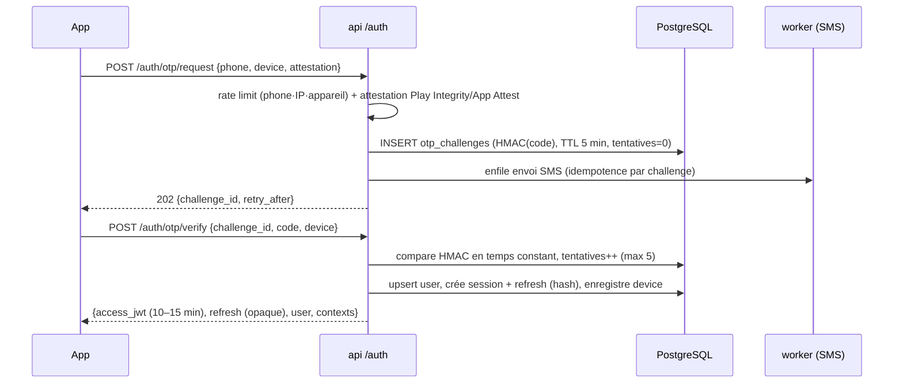
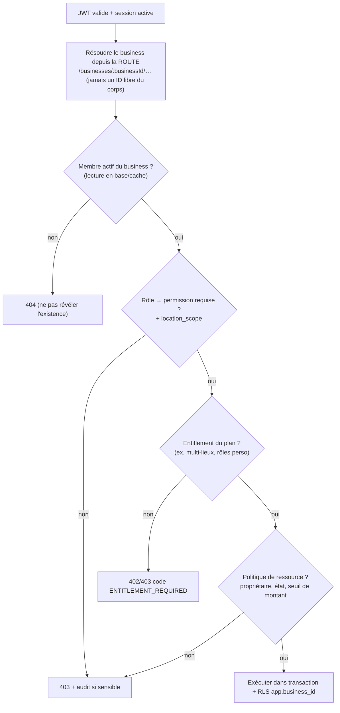

# 04 — Identité, authentification, RBAC, multi-tenant, abonnements

Couvre les points 11, 12, 13, 14.

---

## 1. Modèle d'identité

```
USER (personne physique, 1 compte)
 ├─ PERSONAS activées : CUSTOMER (défaut) · SELLER · SERVICE_PROVIDER · JOB_SEEKER · RECRUITER
 │                      STUDENT · INSTRUCTOR · FARMER · DRIVER · PROPERTY_OWNER
 │      └─ chaque persona = son profil + son statut de vérification (UNVERIFIED…VERIFIED)
 ├─ BUSINESS_MEMBER(business A, rôle ADMIN)
 └─ BUSINESS_MEMBER(business B, rôle CASHIER)
BUSINESS (organisation, tenant) ── LOCATIONS ── MEMBERS ── ROLES ── PERMISSIONS
```

- **Persona ≠ permission.** Une persona ouvre des **fonctionnalités** (un profil vendeur, un CV) ; les **permissions** ne s'appliquent qu'au contexte `Business` (et au staff plateforme).
- **Activation** d'une persona : action explicite (« Devenir vendeur »), avec ses propres prérequis (KYC léger, CGU spécifiques) et **consentements versionnés**.
- Le **contexte actif** côté app : `Personnel` ou `Business X` (sélecteur global). Il pilote la navigation et les en-têtes/route de tenant.

---

## 2. Authentification (comptes clients)

### 2.1 Méthodes

| Méthode                      | Usage                                                                                                                    |
| ---------------------------- | ------------------------------------------------------------------------------------------------------------------------ |
| **Téléphone + OTP** (défaut) | Inscription et connexion. SMS, avec repli **WhatsApp / appel vocal** selon délivrabilité.                                |
| E-mail + OTP                 | Optionnel (récupération, facturation).                                                                                   |
| Mot de passe (Argon2id)      | **Optionnel** ; utile pour connexion rapide/desktop ; jamais requis.                                                     |
| Biométrie                    | **Locale à l'appareil** : déverrouille le refresh token stocké dans Keychain/Keystore. **Rien n'est envoyé au serveur.** |

### 2.2 Flux OTP → session



### 2.3 Jetons et sessions

| Élément             | Spécification                                                                                                                                                                                                                                                                  |
| ------------------- | ------------------------------------------------------------------------------------------------------------------------------------------------------------------------------------------------------------------------------------------------------------------------------ |
| Access token        | JWT **asymétrique (ES256/EdDSA)**, durée **10–15 min**, claims minimaux : `sub`, `sid` (session), `ver` (token_version), `iat/exp`, `iss/aud`. **Aucune permission** dans le jeton (les révocations doivent être effectives). Clés publiques via **JWKS**, rotation planifiée. |
| Refresh token       | **Opaque** (256 bits), durée 30 jours glissante, **rotation à chaque usage**, stocké **haché** (SHA-256).                                                                                                                                                                      |
| Détection de vol    | Réutilisation d'un refresh déjà consommé ⇒ **révocation de toute la famille** + notification sécurité + réauthentification.                                                                                                                                                    |
| Validation session  | `sid` vérifié dans un cache Redis (TTL court) ; révocation immédiate = suppression de la clé + `revoked_at`.                                                                                                                                                                   |
| Déconnexion globale | Incrément `users.token_version` + révocation de toutes les sessions.                                                                                                                                                                                                           |
| Appareils           | Liste (nom, plateforme, dernière activité, localisation approx.) ; **révocation individuelle** ; nouvel appareil ⇒ notification.                                                                                                                                               |
| Durée hors-ligne    | La session mobile peut opérer hors-ligne jusqu'à **N jours** (défaut 14–30, configurable par entitlement Business) puis exige un retour en ligne.                                                                                                                              |

### 2.4 Anti-abus OTP (SMS pumping / brute force)

- Limites par **numéro, IP, appareil, indicatif pays**, plafond de **coût SMS** par pays/heure avec alerte.
- Attestation d'appareil (Play Integrity / App Attest) exigée sur `otp/request` ; **CAPTCHA adaptatif** en cas d'anomalie.
- Code à 6 chiffres, **5 tentatives**, expiration 5 min, **délai croissant** entre renvois, HMAC (jamais en clair, jamais loggué).
- Réponses **uniformes** (pas d'énumération de comptes) ; liste de blocage numéros/appareils/IP.

### 2.5 Récupération de compte

| Cas                                  | Procédure                                                                                                                                                                                    |
| ------------------------------------ | -------------------------------------------------------------------------------------------------------------------------------------------------------------------------------------------- |
| Nouveau téléphone, ancien accessible | OTP sur l'ancien **et** le nouveau + e-mail de notification + **délai de sécurité 24 h** avant que le changement soit effectif si des fonctions financières sont actives.                    |
| Ancien numéro perdu                  | Vérification e-mail (si présent) **ou** demande support avec pièces vérifiées manuellement ; **délai 72 h**, notifications sur tous les appareils/canaux, révocation des sessions à l'issue. |
| Mot de passe oublié                  | OTP ; jamais de question secrète.                                                                                                                                                            |
| SIM swap                             | Actions sensibles (changer le numéro, exporter, retirer des fonds) exigent une **réauthentification récente** + délai ; alertes.                                                             |

### 2.6 Comptes staff (admin)

Table `staff_users` **séparée** ; **SSO OIDC + MFA obligatoire** (TOTP/WebAuthn) ; sessions courtes ; jamais de connexion staff par simple OTP SMS ; cookie `HttpOnly; Secure; SameSite=Strict` + protection **CSRF** (l'admin est le seul client à cookies) ; liste d'IP autorisées optionnelle. Voir [09-admin.md](09-admin.md).

### 2.7 Clients machine (livraison externe, Phase 4)

`api_clients` + `api_keys` (hachées, préfixe visible, scopes, quotas, rotation, expiration) ; signature des **webhooks sortants** (HMAC + horodatage anti-rejeu).

---

## 3. Consentements et vie privée

`user_consents` versionnés : CGU, confidentialité, **analytics**, **marketing**, **personnalisation IA**, **accès IA aux données financières (Money)**, **accès IA aux données Business**. Chaque fonctionnalité sensible **vérifie le consentement côté serveur**. Export et effacement des données : parcours dédiés (Phase 11 au plus tard, conception dès la Phase 0).

---

## 4. RBAC

### 4.1 Trois niveaux, à ne pas confondre

| Niveau                     | Objet                               | Exemples                                                                                       |
| -------------------------- | ----------------------------------- | ---------------------------------------------------------------------------------------------- |
| **Plateforme (staff)**     | `staff_users` + rôles PLATFORM      | SUPER_ADMIN, ADMIN, MODERATOR, VERIFIER, SUPPORT_AGENT, FINANCE, DATA_ANALYST, CONTENT_MANAGER |
| **Business**               | `business_members` + rôles BUSINESS | OWNER, ADMIN, MANAGER, CASHIER, STOCK_KEEPER, ACCOUNTANT, VIEWER, rôles personnalisés          |
| **Persona / propriétaire** | Propriété de la ressource           | « L'auteur de l'avis », « le candidat de la candidature », « le vendeur de l'annonce »         |

### 4.2 Permissions

- Catalogue **défini dans le code**, synchronisé en base par seed idempotent : `<ressource>:<action>` (`sales:create`, `sales:refund`, `inventory:adjust`, `products:update`, `finance:view_profit`, `members:manage`, `subscription:manage`…).
- Permissions **sensibles séparées** : voir les **coûts/bénéfices** ≠ voir les ventes ; **remboursement** ≠ **vente**.
- **Rôles système** immuables (OWNER…), **rôles personnalisés** par business (entitlement `rbac.custom_roles`).
- **Pas d'escalade** : on ne peut accorder que des permissions qu'on détient ; le **dernier OWNER** ne peut pas être retiré ; transfert de propriété = flux dédié avec réauthentification.

### 4.3 Matrice par défaut (Business)

| Domaine                   | OWNER | ADMIN |     MANAGER     |    CASHIER     | STOCK_KEEPER | ACCOUNTANT | VIEWER |
| ------------------------- | :---: | :---: | :-------------: | :------------: | :----------: | :--------: | :----: |
| Vendre (`sales:create`)   |  ✅   |  ✅   |       ✅        |       ✅       |      —       |     —      |   —    |
| Remboursement/retour      |  ✅   |  ✅   |       ✅        |    ⚠️ seuil    |      —       |     —      |   —    |
| Produits (créer/modifier) |  ✅   |  ✅   |       ✅        |       —        |      ✅      |     —      |   —    |
| Ajuster le stock          |  ✅   |  ✅   |       ✅        |       —        |      ✅      |     —      |   —    |
| Achats / fournisseurs     |  ✅   |  ✅   |       ✅        |       —        |      ✅      |     ✅     |   —    |
| Crédits clients           |  ✅   |  ✅   |       ✅        | ✅ (encaisser) |      —       |     ✅     |   —    |
| Dépenses                  |  ✅   |  ✅   |       ✅        |       —        |      —       |     ✅     |   —    |
| Voir bénéfices/coûts      |  ✅   |  ✅   | ⚠️ configurable |       —        |      —       |     ✅     |   —    |
| Rapports                  |  ✅   |  ✅   |       ✅        |       —        |      —       |     ✅     |   ✅   |
| Employés / rôles          |  ✅   |  ✅   |        —        |       —        |      —       |     —      |   —    |
| Abonnement / paiement     |  ✅   |   —   |        —        |       —        |      —       |     —      |   —    |
| Publier sur Marketplace   |  ✅   |  ✅   |       ✅        |       —        |      —       |     —      |   —    |

⚠️ = soumis à une règle contextuelle (seuil de montant, configuration).

### 4.4 Évaluation (chaîne du brief : USER → BUSINESS → ROLE → PERMISSION → RESOURCE)



- **RBAC + ABAC léger** : la politique de ressource couvre propriété, état de la ressource, seuils (ex. un caissier ne rembourse pas > X).
- **Cache** des permissions Redis par `(user, business)` TTL 60 s, **invalidé** par `MEMBER_ROLE_CHANGED`.
- Réponse **404** (et non 403) quand le tenant n'est pas accessible : ne pas confirmer l'existence.
- Chaque action **sensible** (changement de rôle, remboursement, export, suspension) est **auditée**.

### 4.5 Invitations

Invitation par téléphone/e-mail → jeton **haché**, expirant, à usage unique, lié à un rôle ; acceptation liée à un compte authentifié dont le téléphone correspond ; annulation/révocation à tout moment.

---

## 5. Multi-tenant : application de bout en bout

| Couche             | Mécanisme                                                                                                                                              |
| ------------------ | ------------------------------------------------------------------------------------------------------------------------------------------------------ |
| **Entrée**         | `X-Business-Id` **n'existe pas** : le tenant est dans le **chemin** `/businesses/:businessId/…` ; le `TenantGuard` vérifie l'appartenance.             |
| **Application**    | Repositories exigeant un `TenantContext` ; **aucune** méthode `findById(id)` sans tenant sur une table tenant.                                         |
| **Base**           | RLS `FORCE` + rôle `NOBYPASSRLS` + FK composites (voir [03 §6](03-database.md)).                                                                       |
| **Workers**        | Le `business_id` du job est **revalidé** ; contexte RLS posé avant tout accès.                                                                         |
| **Cache**          | Clés namespacées `t:{businessId}:…`.                                                                                                                   |
| **Stockage**       | Préfixe `biz/{businessId}/…` ; **URLs signées à courte durée** ; jamais de bucket public pour des données privées.                                     |
| **Recherche**      | L'index **global** n'ingère que des données déjà publiques ; la recherche **privée** (produits, clients, ventes) interroge directement la DB sous RLS. |
| **IA**             | Le `business_id` est **injecté par le serveur** dans les outils ; le LLM ne le fournit jamais.                                                         |
| **Admin/support**  | Rôle DB dédié, accès **motivé, limité dans le temps et audité** ; jamais d'usurpation de session.                                                      |
| **Logs/métriques** | `business_id` présent pour l'observabilité ; **aucune donnée métier** dans les logs.                                                                   |

**Tests de fuite (bloquants en CI)** — générés à partir du catalogue PG : pour chaque table tenant, (a) RLS active + `FORCE`, (b) sous le tenant A, 0 ligne du tenant B, (c) insertion croisée refusée, (d) FK composite empêche le lien inter-tenant, (e) contexte absent ⇒ 0 ligne. **Un test de contrat API** vérifie que chaque route `/businesses/:id/**` rejette un utilisateur non membre.

---

## 6. Abonnements et entitlements

### 6.1 Modèle

```
Subscription (sujet USER ou BUSINESS, statut) → Plan (FREE|PRO|BUSINESS|PREMIUM) → PlanEntitlements
                                                        ↑
            EntitlementOverride (promo/support, expirable)   UsageCounter (quotas par période)
```

| Type d'entitlement | Exemple                                                      |
| ------------------ | ------------------------------------------------------------ |
| Booléen            | `rbac.custom_roles`, `marketplace.publish`, `reports.export` |
| Limite             | `products.max = 100`, `locations.max = 1`, `members.max = 3` |
| Quota périodique   | `ai.messages.monthly = 50`                                   |

### 6.2 Règles

1. **Une seule porte d'entrée** : `EntitlementService.check(subject, code)` / `.consume(subject, meter, n)`. Aucune vérification de plan éparpillée dans les modules ; les modules déclarent `@RequireEntitlement('…')`.
2. **Le serveur applique**, le mobile ne fait que _masquer/afficher_ (`GET /me/entitlements`, mis en cache avec date d'expiration).
3. **Dégradation, jamais perte de données** : un abonnement expiré passe en **lecture seule / limites FREE**, les données sont conservées ; **la caisse ne se verrouille jamais en pleine journée** (délai de grâce et cache offline d'entitlements de plusieurs jours).
4. **Feature flags ≠ entitlements** : les flags pilotent le **déploiement** (pourcentage, pays, version d'app, kill-switch) ; les entitlements pilotent le **droit commercial**.
5. **Facturation** via le moteur de paiement (`payable = billing.invoice`). Le mobile money n'offrant pas d'auto-débit fiable : **relance + lien de paiement + période de grâce** (`TRIALING → ACTIVE → PAST_DUE → GRACE → EXPIRED`).
6. **Statut des stores** : les abonnements/contenus **numériques** vendus _dans_ l'app peuvent relever des règles de facturation d'Apple/Google — **à trancher avant la Phase 10** (risque R9).
7. Changement de plan : prorata/remise **déterministes** côté serveur ; historique `subscription_events` ; événement `SUBSCRIPTION_CHANGED` invalide les caches.

### 6.3 Plans (proposition initiale, à valider produit)

|                     | FREE                           | PRO                                       | BUSINESS                                    | PREMIUM                            |
| ------------------- | ------------------------------ | ----------------------------------------- | ------------------------------------------- | ---------------------------------- |
| Cible               | Découverte                     | Petit commerçant                          | Multi-boutiques / équipe                    | Utilisateur intensif (IA, Academy) |
| Portée              | Business/User                  | Business                                  | Business                                    | User                               |
| Exemples de limites | 1 lieu, 3 membres, 50 produits | 1 lieu, 5 membres, 500 produits, rapports | Lieux/membres étendus, rôles perso, exports | Quotas IA élevés, contenu Academy  |

Les valeurs chiffrées sont **des données de configuration** (`plan_entitlements`), pas du code.
