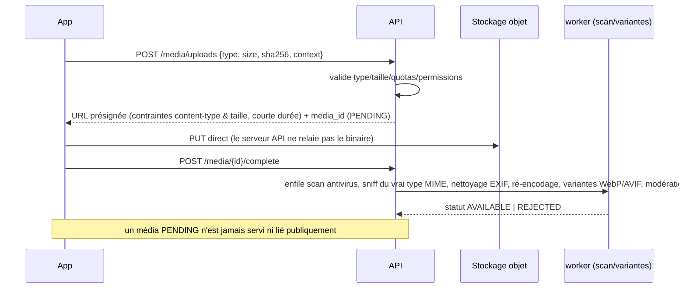

# 05 — Architecture API

Couvre le point 6.

---

## 1. Principes

| Sujet                   | Décision                                                                                                                                                                                                    |
| ----------------------- | ----------------------------------------------------------------------------------------------------------------------------------------------------------------------------------------------------------- |
| Style                   | REST/JSON, ressources au pluriel, `/api/v1`, OpenAPI 3.1 **générée du code** (Zod → schéma), snapshot versionné dans `shared/api-contracts/`                                                                |
| Versionnement           | Majeur dans l'URL (`/v1`). **Changements additifs uniquement** dans une version. Cassant ⇒ `/v2` en parallèle avec période de dépréciation. **Diff OpenAPI en CI** (détection de rupture).                  |
| Anciens clients mobiles | `GET /meta/app-config` renvoie `min_supported_version`, `recommended_version`, drapeaux, modules par pays. En dessous du minimum : écran de mise à jour forcée. En-tête `X-App-Version` sur chaque requête. |
| Formats                 | JSON `snake_case` ; dates ISO-8601 UTC ; argent `{ "amount_minor": 150000, "currency": "GNF" }` ; ID = UUID (chaînes)                                                                                       |
| Langue                  | `Accept-Language` ; `code` d'erreur stable, message localisé côté client                                                                                                                                    |
| Compression             | gzip/brotli ; ETag sur lectures cacheables                                                                                                                                                                  |

## 2. Familles de routes

| Famille           | Préfixe                               | Auth                              | Exemples                                                         |
| ----------------- | ------------------------------------- | --------------------------------- | ---------------------------------------------------------------- |
| Publique          | `/api/v1/public/…`                    | aucune (rate limit renforcé)      | catalogue Marketplace, annonces Immo, offres d'emploi, recherche |
| Utilisateur       | `/api/v1/me/…`, `/api/v1/<module>/…`  | JWT                               | profil, commandes, candidatures, IA, notifications               |
| Business (tenant) | `/api/v1/businesses/:businessId/…`    | JWT + membership + permissions    | ventes, produits, stock, contacts, rapports                      |
| Machine           | `/api/v1/partner/…`                   | API key + signature               | création de livraisons externes                                  |
| Admin             | `/admin/v1/…` (hôte séparé conseillé) | staff SSO + MFA + RBAC plateforme | modération, vérification, finance                                |
| Webhooks entrants | `/webhooks/:provider`                 | signature HMAC/PSP                | paiements, SMS delivery receipts                                 |
| Temps réel        | `/ws` (Socket.IO)                     | JWT                               | messages, suivi de livraison, notifications                      |

## 3. Conventions

### 3.1 Erreurs — RFC 9457

```json
{
  "type": "https://docs.thy.example/errors/STOCK_INSUFFICIENT",
  "title": "Stock insuffisant",
  "status": 409,
  "code": "STOCK_INSUFFICIENT",
  "detail": "Quantité demandée supérieure au stock disponible.",
  "trace_id": "01J…",
  "errors": [{ "field": "items[0].quantity", "code": "MAX_EXCEEDED" }]
}
```

Erreurs 5xx : message générique + `trace_id` uniquement (jamais de détail interne).

### 3.2 Pagination, tri, filtres

- **Curseur** : `?limit=20&cursor=<opaque>` → `{ "items": [...], "next_cursor": "…" }` ; `limit` plafonné (100).
- Tri : liste blanche par ressource (`?sort=-created_at`). Filtres explicites, jamais d'expression libre vers SQL.
- Delta pour la sync : `?updated_after=…` avec **tombstones** (voir [08](08-offline-sync.md)).

### 3.3 Idempotence

- En-tête `Idempotency-Key` (UUID) **obligatoire** sur les POST à effet financier/stock (ventes, commandes, paiements, remboursements, sync push).
- Stockage `ops.idempotency_keys` : clé + empreinte de la requête + réponse ; **même clé + même corps ⇒ même réponse** ; même clé + corps différent ⇒ `422 IDEMPOTENCY_KEY_REUSED` ; rétention 48 h (7 j pour la sync).

### 3.4 Concurrence

`ETag`/`If-Match` (ou champ `version`) sur les mises à jour ⇒ `412`/`409 VERSION_CONFLICT`. Pour la sync, voir résolution des conflits.

### 3.5 Limitation de débit

Politiques par route : `otp` (très strict), `login`, `search`, `write`, `payments`, `ai`. Réponses `429` avec `Retry-After`. Clés : IP + utilisateur + appareil + (API key). En-têtes `RateLimit-*`.

### 3.6 Sécurité HTTP

HSTS, `X-Content-Type-Options`, CSP stricte (admin), CORS **liste blanche** d'origines (admin uniquement), taille de corps limitée par route, timeouts, validation stricte (`additionalProperties: false`), **aucun champ non déclaré accepté** (protection _mass assignment_).

## 4. Envoi de fichiers (médias)



Accès : URL **signées à courte durée** pour le privé (KYC, CV, preuves de livraison) ; CDN pour les variantes publiques déjà validées.

## 5. Webhooks entrants

1. Lecture du **corps brut**, vérification de **signature** et de la **fenêtre temporelle**.
2. **Insertion** dans `pay.provider_webhook_events` (unicité `provider + external_event_id`) puis **réponse 200 rapide**.
3. Traitement **asynchrone** par le `worker`, qui **confirme le statut auprès du PSP** (ne pas faire confiance au seul payload) et compare montant/devise/référence attendus.

## 6. Temps réel (Socket.IO)

- Authentification par JWT au handshake ; rooms : `user:{id}`, `conversation:{id}`, `delivery:{id}`, `business:{id}` (après contrôle d'appartenance).
- Événements **légers et non autoritaires** : ils déclenchent un rafraîchissement REST. Perte de connexion ⇒ rattrapage par REST + push FCM.
- Adaptateur Redis pour le multi-instance ; limites de débit par socket.

## 7. Catalogue des groupes d'endpoints (vue d'ensemble, non exhaustive)

| Module        | Ressources principales (exemples)                                                                                                                                        |
| ------------- | ------------------------------------------------------------------------------------------------------------------------------------------------------------------------ |
| auth          | `POST /auth/otp/request`, `/auth/otp/verify`, `/auth/refresh`, `/auth/logout`, `/auth/logout-all`, `GET/DELETE /me/sessions`, `/me/devices`                              |
| users         | `GET/PATCH /me`, `/me/personas`, `/me/consents`, `/me/preferences`, `GET /me/app-config`, `/me/entitlements`                                                             |
| businesses    | `POST /businesses`, `/businesses/:id/members`, `/invitations`, `/locations`, `/roles`                                                                                    |
| business      | `/businesses/:id/products`, `/stock/movements`, `/contacts`, `/sales`, `/cash-sessions`, `/purchases`, `/expenses`, `/credits`, `/reports/…`, `/sync/pull`, `/sync/push` |
| marketplace   | `/public/listings`, `/carts`, `/orders`, `/orders/:id/cancel`, `/businesses/:id/listings` (publier un produit)                                                           |
| payments      | `POST /payments` (intention), `GET /payments/:id`, `POST /payments/:id/cancel`, `POST /refunds`                                                                          |
| delivery      | `/deliveries`, `/deliveries/:id/events`, `/driver/me/missions`, `/partner/deliveries`                                                                                    |
| services      | `/public/providers`, `/service-requests`, `/quotes`, `/bookings`                                                                                                         |
| immo          | `/public/properties`, `/property-listings`, `/visits`                                                                                                                    |
| jobs          | `/public/jobs`, `/job-applications`, `/me/resume`, `/job-alerts`                                                                                                         |
| academy       | `/courses`, `/lessons/:id`, `/quizzes/:id/attempts`, `/enrollments`                                                                                                      |
| agro          | `/public/offers`, `/agro/orders`                                                                                                                                         |
| finance       | `/me/finance/accounts`, `/transactions`, `/budgets`, `/goals`                                                                                                            |
| ai            | `POST /ai/conversations/:id/messages` (SSE), `GET /ai/conversations`, `POST /ai/actions/:id/confirm`                                                                     |
| messaging     | `/conversations`, `/conversations/:id/messages`, `/blocks`                                                                                                               |
| reviews       | `POST /reviews` (éligibilité vérifiée), `GET /public/subjects/:type/:id/reviews`                                                                                         |
| search        | `GET /public/search?q=&modules=&lat=&lng=`, `GET /public/search/:module`                                                                                                 |
| moderation    | `POST /reports`, (admin) `/admin/v1/moderation/cases`                                                                                                                    |
| notifications | `/me/notifications`, `/me/notification-preferences`, `PUT /me/devices/:id/push-token`                                                                                    |
| support       | `/support/tickets`, `/disputes`                                                                                                                                          |

## 8. Génération et contrats

- **Serveur → OpenAPI → clients** : client Dart (Dio) et types TS (admin) **générés** ; interdit d'écrire un DTO d'API à la main côté client.
- **Tests de contrat** : validation des réponses contre le schéma ; fuzzing (Schemathesis) sur staging.
- **Événements** : schémas Zod publiés dans `shared/api-contracts/events/`.
