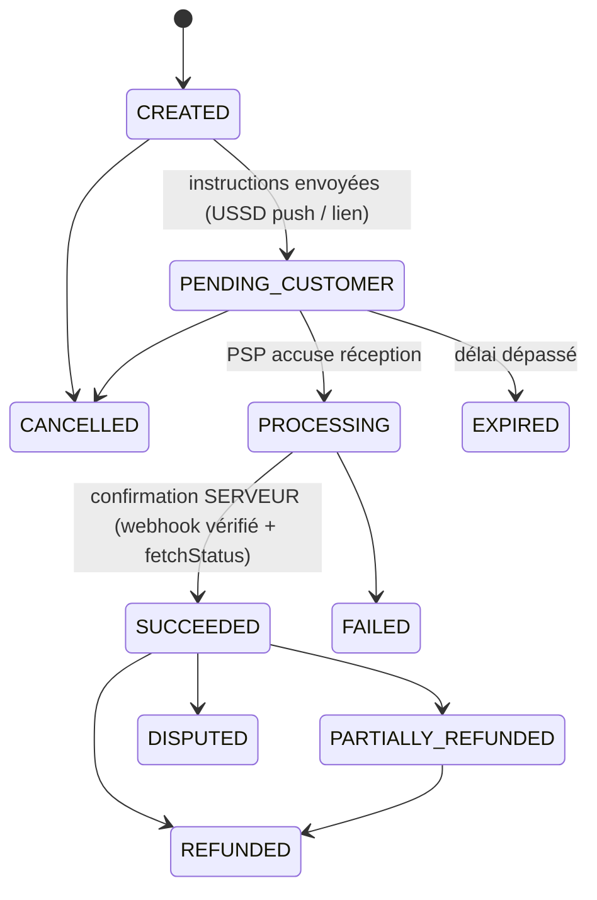
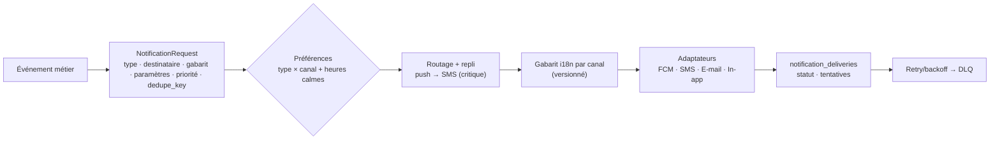
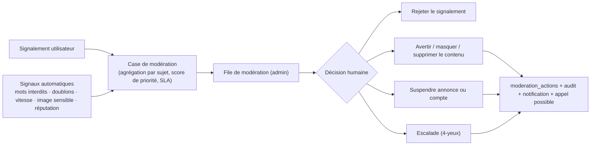

# 06 — Moteurs de plateforme partagés

Couvre les points 8 (paiements), 9 (notifications), 15 (recherche), 16 (messagerie), 17 (modération, vérification, avis). Chaque moteur est **réutilisé** par plusieurs modules : ne jamais en recréer une version locale.

---

## 1. Paiements (`payments`)

### 1.1 Deux concepts à ne jamais confondre

| Concept                   | Table               | Sens                                                                                                                                                                                                                          |
| ------------------------- | ------------------- | ----------------------------------------------------------------------------------------------------------------------------------------------------------------------------------------------------------------------------- |
| **Paiement plateforme**   | `pay.payments`      | Argent collecté via un PSP (commande Marketplace, réservation, abonnement, fret Agro). **Confirmé par le serveur.**                                                                                                           |
| **Règlement déclaré POS** | `biz.sale_payments` | Le caissier enregistre « espèces », « Orange Money reçu », « crédit ». **Déclaratif** : un règlement mobile money externe est marqué `UNVERIFIED` (référence saisie) et n'est jamais présenté comme un paiement THY confirmé. |

### 1.2 Port `PaymentProvider`

```ts
interface PaymentProvider {
  readonly code: string; // 'provider_x'
  capabilities(): {
    collect: boolean;
    refund: boolean;
    payout: boolean;
    escrowOrSplit: boolean;
    recurring: boolean;
    countries: string[];
    currencies: string[];
    methods: PaymentMethodKind[];
  };
  initiate(req: InitiateRequest): Promise<InitiateResult>; // idempotent (req.idempotencyKey)
  fetchStatus(ref: ProviderRef): Promise<ProviderStatus>; // source de vérité côté PSP
  verifyWebhook(raw: Buffer, headers: Headers): VerifiedWebhook; // lève si signature/horodatage invalides
  cancel(ref: ProviderRef): Promise<CancelResult>;
  refund(req: RefundRequest): Promise<RefundResult>;
  payout(req: PayoutRequest): Promise<PayoutResult>;
}
```

Adaptateurs : un par PSP (sélection commerciale/juridique **D6**). **`SandboxProvider`** pour les tests uniquement : enregistré si et seulement si `APP_ENV ≠ production` ; le démarrage **échoue** s'il est configuré en production. Il ne « réussit » jamais un paiement de lui-même : le succès simulé passe par un webhook de test signé.

### 1.3 Machine d'états



Toutes les transitions sont **validées côté serveur** (table de transitions unique, testée), **journalisées** (`payment_events`), et émettent un événement d'outbox.

### 1.4 Règles d'or

1. **Le « success » du client ne compte pas.** Seul l'état serveur fait foi ; le mobile interroge `GET /payments/:id` et/ou reçoit un push/WS.
2. **Idempotence à chaque couche** : clé côté API ; référence PSP unique ; webhook dédupliqué ; écriture comptable unique par transition.
3. **Vérification de montant/devise/référence** contre l'attendu avant `SUCCEEDED`.
4. **Expiration** : `PENDING_CUSTOMER` a un TTL (relié à la réservation de stock) ; expiré ⇒ événement + libération.
5. **Réconciliation** : (a) job périodique qui interroge le PSP pour les paiements non terminaux au-delà de N minutes ; (b) rapprochement **quotidien** avec les relevés du PSP ; toute divergence ⇒ alerte + file de traitement en admin.
6. **Pas de PAN de carte** dans THY ; pages/SDK hébergés par le PSP.
7. **Journalisation expurgée** : numéros masqués, jamais de secrets ni de jeton.

### 1.5 Grand livre à double entrée

Écritures **immuables**, équilibrées par journal. Exemple, commande de 100 000 avec commission de 5 % :

| Événement            | Débit                                | Crédit              | Montant        |
| -------------------- | ------------------------------------ | ------------------- | -------------- |
| Paiement confirmé    | `provider_clearing`                  | `seller_payable`    | 95 000         |
|                      | `provider_clearing`                  | `platform_revenue`  | 5 000          |
| Versement au vendeur | `seller_payable`                     | `payout_clearing`   | 95 000         |
| Remboursement total  | `seller_payable`, `platform_revenue` | `provider_clearing` | 95 000 + 5 000 |

Le solde d'un compte est **calculé**, jamais édité. Le grand livre trace des **obligations** ; **THY ne garde pas de fonds** (ADR-011).

### 1.6 Séquestre, versements, litiges

- Libération au vendeur **après** `DELIVERED` + fenêtre de contestation (configurable) ; blocage si litige ouvert.
- **Paiements sortants** : file de versements, seuils d'approbation manuelle, **double validation** (4-yeux) en admin au-delà d'un montant ; exécutés via `payout()` du PSP.
- **Paiement à la livraison (COD)** : moyen `CASH_ON_DELIVERY` avec preuve de collecte par le livreur et **remise de caisse** rapprochée ; zone de fraude à surveiller (Phase 4).
- **Abonnements** : facture `billing.invoices` payée via ce moteur ; pas d'auto-débit présumé (voir [04 §6](04-identity-access.md)).

### 1.7 Points juridiques (à valider avant Phase 3)

Statut réglementaire de la collecte pour compte de tiers, séquestre, KYC/LCB-FT du PSP, fiscalité des commissions, droit de la consommation (remboursements, rétractation). **Décision produit + conseil juridique**, pas une décision de code.

---

## 2. Notifications (`notifications`)

### 2.1 Pipeline



### 2.2 Règles

- **Types** : commande, paiement, livraison, stock, emploi, service, immobilier, cours, finance, **sécurité**. Chaque type a un **canal par défaut** et une **criticité**.
- **Préférences** : matrice `type × canal` par utilisateur ; **les notifications de sécurité et d'OTP ne sont pas désactivables**.
- **Repli** : push non délivré/ouvert sous N minutes ⇒ SMS **uniquement** pour les types critiques (code de livraison, paiement, sécurité) — plafond de coût.
- **Push** : charge **minimale** (pas de PII/montants sensibles sur l'écran de verrouillage), _deep link_ vers la route, `collapse_key` pour éviter le spam ; nettoyage des jetons invalides (`UNREGISTERED`).
- **In-app** : boîte de réception (REST + WS), lu/non lu, expirations.
- **Fournisseurs** interchangeables (`SmsProvider`, `EmailProvider`) ; **deux fournisseurs SMS** avec bascule.
- **Anti-doublon** : `dedupe_key` ; regroupement (digest) pour les événements fréquents (ex. résumé quotidien Business).
- **Observabilité** : taux de délivrance par canal/fournisseur, coût SMS, latence.

---

## 3. Messagerie (`messaging`)

Réutilisée par Marketplace, Services, Jobs, Immo, Delivery (et Support).

| Élément                     | Conception                                                                                                                                                                                                                                              |
| --------------------------- | ------------------------------------------------------------------------------------------------------------------------------------------------------------------------------------------------------------------------------------------------------- |
| `conversations`             | `context_type/context_id` (ex. `LISTING`, `SERVICE_REQUEST`, `JOB_APPLICATION`, `PROPERTY_LISTING`, `DELIVERY`, `SUPPORT`), **unique** `(context, paire de participants)`                                                                               |
| `conversation_participants` | `user_id`, `business_id` nullable (**« parler au nom d'une boutique »**), `last_delivered_message_id`, `last_read_message_id`, `muted`                                                                                                                  |
| `messages`                  | `client_msg_id` (idempotence/offline), `type` (TEXT, IMAGE, FILE, LOCATION, OFFER, SYSTEM), `body`, `media_id`, `reply_to`, `deleted_at` ; id UUIDv7 (ordre)                                                                                            |
| Statuts                     | **envoyé / reçu / lu** via **pointeurs par participant** (pas une ligne par message et par lecteur)                                                                                                                                                     |
| Temps réel                  | WS `conversation:{id}` ; destinataire hors ligne ⇒ push FCM ; rattrapage REST par curseur                                                                                                                                                               |
| Blocage & signalement       | `user_blocks` ; signalement d'un message ⇒ `trust.reports` (le message et son contexte sont conservés comme preuve)                                                                                                                                     |
| Anti-abus                   | Limites de débit, plafond de nouvelles conversations/jour, détection de spam/liens, quarantaine des pièces jointes (scan)                                                                                                                               |
| Confidentialité             | **Chiffrement en transit et au repos**. **Pas de chiffrement de bout en bout en v1** (modération, litiges, preuves) — transparent pour l'utilisateur. Numéros de téléphone non divulgués par défaut ; « partager mon numéro » est une action explicite. |
| Contrôle produit à trancher | Autoriser ou non les liens « appeler / WhatsApp » (pratique courante localement, mais contourne paiement et avis). Recommandation : autorisé **après** accord mutuel dans la conversation.                                                              |
| Volumétrie                  | Partitionnement de `messages` par temps si nécessaire ; rétention configurable                                                                                                                                                                          |

---

## 4. Recherche (`search`)

### 4.1 Deux niveaux

| Niveau                   | Objet                                                              | Source                                                         | Confidentialité                                                                                                          |
| ------------------------ | ------------------------------------------------------------------ | -------------------------------------------------------------- | ------------------------------------------------------------------------------------------------------------------------ |
| **Recherche globale**    | « iPhone » ⇒ résultats **groupés par module**                      | Table dénormalisée `search.documents` alimentée par événements | **Uniquement du public** (annonces publiées, profils vérifiés/actifs)                                                    |
| **Recherche par module** | Filtres riches (prix, catégorie, distance, type de bien, salaire…) | Requêtes du module sur ses tables                              | Public ; **la recherche privée** (produits/clients/ventes d'un business) interroge la DB **sous RLS**, hors index global |

### 4.2 Flux d'indexation

`LISTING_PUBLISHED / PROPERTY_LISTING_VERIFIED / PROVIDER_ACTIVATED …` → **indexeur (worker)** → upsert dans `search.documents` ; `…UNPUBLISHED / SUSPENDED / ARCHIVED` → suppression. **Visibilité contrôlée à l'indexation ET re-vérifiée à la lecture.**

### 4.3 Requête globale

`GET /public/search?q=iphone&modules=marketplace,services,immo,jobs&lat=…&lng=…`
Réponse groupée : `{ marketplace: { items, total }, services: {…}, … }` avec top-N par module + lien « voir tout » vers la recherche du module. **Jamais de mélange** dans une liste unique sans séparation de module.

### 4.4 Pertinence

`ts_rank` (config `french` + `unaccent`) + similarité trigramme (tolérance aux fautes) + **distance** (PostGIS) + fraîcheur + boost « vendeur vérifié » borné + pénalités (signalements, contenu suspendu). **Suggestions** : préfixes/trigrammes + requêtes populaires. Journal des requêtes **sans résultat** (analytics) pour enrichir le catalogue.

### 4.5 Évolution

Port `SearchIndexer`/`SearchQuery` ⇒ bascule vers Meilisearch/Typesense sans changer les modules (seuils : ADR-008).

---

## 5. Vérification (`verification`)

Un seul moteur pour : utilisateur, entreprise, professionnel, vendeur, propriétaire, recruteur.

| Élément                          | Conception                                                                                                                                                                                                       |
| -------------------------------- | ---------------------------------------------------------------------------------------------------------------------------------------------------------------------------------------------------------------- |
| Statuts                          | `UNVERIFIED → PENDING → VERIFIED                                                                                                                                                                                 | REJECTED | SUSPENDED`(+`EXPIRED` géré par date) |
| Demande                          | `verification_requests(subject_type, subject_id, level, status, reviewed_by_staff_id, decided_at, expires_at, decision_reason)` + `verification_documents` (fichiers chiffrés) + check-list                      |
| Niveaux (configurables par pays) | **L0** numéro confirmé (OTP) · **L1** identité (pièce + selfie/vérif manuelle) · **L2** entreprise (registre du commerce, NIF…) · **L3** vérification terrain/propriété (Immo)                                   |
| **Règle d'intégrité**            | Le statut `VERIFIED` ne peut être posé que par une **décision staff** (`verification:approve`) ; contrainte DB `verified_by_staff_id NOT NULL` ; **audit** ; expiration/renouvellement                           |
| **Vocabulaire produit**          | L0 = « **Numéro confirmé** » (jamais « vérifié ») ; le badge « **Vérifié par THY** » n'apparaît **que** pour un statut `VERIFIED` non expiré. Aucun badge « vérifié » par défaut ni par heuristique automatique. |
| Documents                        | Bucket privé, URL signées courtes, **accès journalisé**, purge selon rétention légale, masquage par défaut en admin                                                                                              |
| v1                               | **Revue manuelle** par le staff (file dans l'admin, SLA). Pas de faux « KYC automatique » : une intégration tierce ne sera affichée comme telle que si elle existe réellement.                                   |

---

## 6. Modération et signalements (`moderation`)



- **Sujets** : produit/annonce, message, avis, profil, offre d'emploi, bien immobilier, cours, utilisateur/business.
- **Automatisation bornée** : les signaux automatiques peuvent **retenir** un contenu (`PENDING_REVIEW`) ou le **prioriser**, mais un **bannissement** ou une suspension de compte exige une **décision humaine** (les faux positifs sont coûteux).
- **Actions** : `DISMISS, WARN, HIDE_CONTENT, REMOVE_CONTENT, SUSPEND_LISTING, SUSPEND_ACCOUNT, BAN` ; motif codé + notes ; **droit de recours** ; tout est **audité**. Double validation pour `BAN`.
- **Fraude** : vélocité (inscriptions/annonces/messages), réseau appareil/téléphone, listes noires (numéros, appareils), détection de faux avis (voir §7), annonces suspectes (prix anormal, photos dupliquées, demande d'avance).
- **Exigence des stores** pour le contenu généré par les utilisateurs : mécanismes de **signalement, blocage et modération** présents dès la Phase 3.
- **Litiges** (`trust.disputes`) : commande, réservation, fret ; états `OPEN → EVIDENCE → RESOLVED`, preuves via `media_links`, décision tracée, lien avec la libération/retenue des fonds.

---

## 7. Avis et notations (`reviews`)

| Module      | Interaction requise (éligibilité)                                                     | Sujet noté        |
| ----------- | ------------------------------------------------------------------------------------- | ----------------- |
| Marketplace | Commande `DELIVERED`/retirée, **acheteur = auteur**                                   | Vendeur / produit |
| Services    | Réservation `COMPLETED`                                                               | Professionnel     |
| Delivery    | Livraison `DELIVERED` (destinataire/expéditeur)                                       | Livreur           |
| Immo        | Visite `COMPLETED` **confirmée par les deux parties**                                 | Annonceur/agent   |
| Jobs        | **Désactivé par défaut** (sensible) ; éventuel avis employeur après embauche déclarée | —                 |

- **Éligibilité vérifiée serveur** via un `ReviewEligibilityResolver` fourni par chaque module ; `UNIQUE(author, interaction, subject)` ; fenêtre de dépôt limitée ; **auteur ≠ propriétaire du sujet**.
- **Réponse du vendeur** (une seule), **édition historisée**, **signalement** ⇒ modération.
- **Agrégats** `rating_summaries` (moyenne, distribution, nombre) mis à jour par événements ; classement par **moyenne bayésienne** (évite qu'un vendeur à 1 avis 5★ dépasse un vendeur à 200 avis 4,8★).
- **Anti-fraude** : détection de grappes (même appareil/numéro/réseau), pics anormaux, avis croisés ; badge naturel « achat vérifié ».

---

## 8. Médias (`media`) — points d'architecture

Upload direct présigné, statut `PENDING → AVAILABLE | REJECTED`, scan antivirus + vrai type MIME + nettoyage EXIF + ré-encodage, variantes (miniature/carte/plein) en WebP/AVIF, modération d'image, quotas par entitlement, purge des orphelins. Détail : [05 §4](05-api.md).

## 9. Géo (`geo`)

- **Adresse = pin GPS + repère textuel** (adressage informel) ; validation de la précision ; `geography(Point)`.
- `GeoProvider` (tuiles, géocodage, itinéraires) — ADR-014 ; PostGIS pour **zones de service**, rayon de livraison, recherche par distance, exclusion de chevauchement.
- **Position vive des livreurs** en Redis (TTL) ; trace persistée **uniquement pendant une livraison active**, échantillonnée, partitionnée, purgée.
- Respect de la vie privée : précision réduite côté public (Immo : zone approximative avant contact), jamais de position exacte d'un particulier sans consentement.

## 10. Favoris et alertes (`engagement`)

`favorites` polymorphes ; `saved_searches` (module + filtres JSON validés + fréquence) ⇒ un job compare les nouveaux documents `search.documents` aux alertes et émet des notifications (Immo, Jobs, Marketplace).
