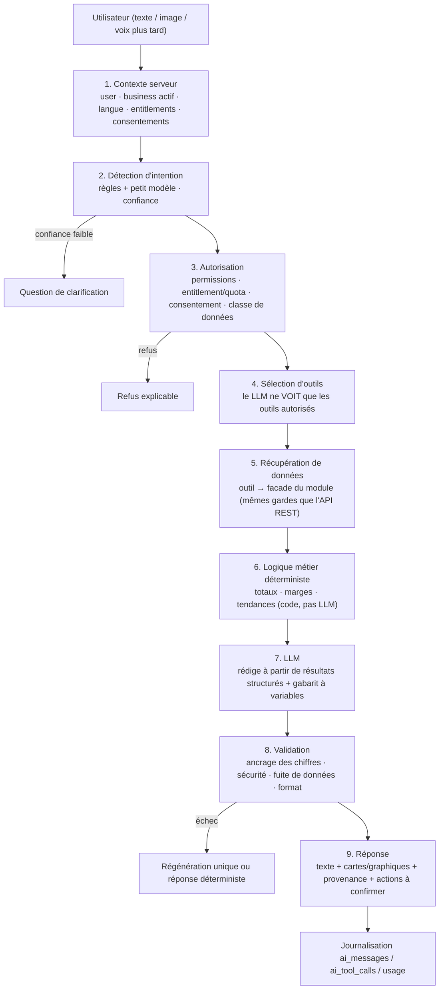
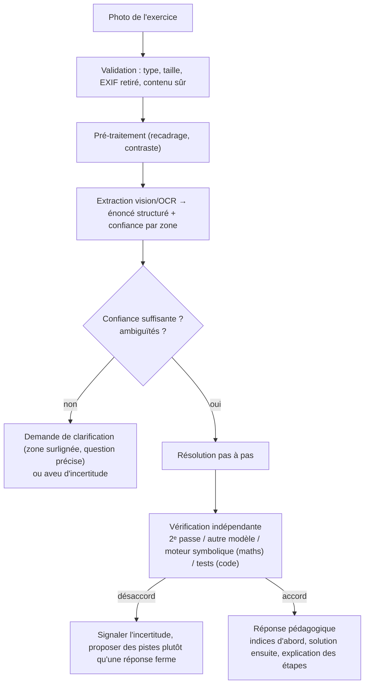

# 07 — Architecture IA (THY AI)

Couvre le point 7. **Principe fondateur : le LLM rédige et explique ; il ne calcule pas, ne décide pas, n'accède pas directement aux données.**

---

## 1. Pipeline obligatoire



## 2. Composants

### 2.1 `LlmProvider` (port) et routage

```ts
interface LlmProvider {
  readonly code: string;
  capabilities(): {
    tools: boolean;
    vision: boolean;
    streaming: boolean;
    embeddings: boolean;
    maxContext: number;
  };
  chat(req: ChatRequest): Promise<ChatResult>;
  stream(req: ChatRequest): AsyncIterable<ChatChunk>;
  embed?(req: EmbedRequest): Promise<EmbedResult>;
}
```

- **Routage par tâche** : petit/rapide (intention, classification, reformulation) · modèle « raisonnement » (analyse Business) · **modèle vision** (Academy).
- **Résilience** : timeouts, retries bornés, _circuit breaker_, **repli** sur un second fournisseur, dégradation gracieuse (les cartes de données déterministes restent affichées si le LLM tombe).
- **Contrat fournisseur** à vérifier : non-entraînement sur nos données, rétention minimale, résidence, DPA. Aucune **clé LLM dans l'app mobile**.

### 2.2 Registre d'outils (`AiTool`)

```ts
interface AiTool<I, O> {
  name: string; // 'business.sales_summary'
  description: string; // vu par le LLM
  input: ZodSchema<I>; // validé côté serveur
  requiredPermissions: Permission[]; // ex. 'reports:view'
  requiredEntitlements?: string[];
  dataClass: "PUBLIC" | "USER_PRIVATE" | "TENANT_PRIVATE" | "FINANCIAL" | "PII";
  consent?: ConsentKey; // ex. 'ai.finance_access'
  sideEffect: "NONE" | "DRAFT" | "WRITE";
  execute(ctx: ToolContext, input: I): Promise<O>; // ctx injecté PAR LE SERVEUR
}
```

- **Le LLM ne fournit jamais** `user_id`, `business_id`, ni aucun identifiant de tenant : ils viennent de `ToolContext` (serveur). Les paramètres du LLM sont validés comme n'importe quelle entrée non fiable.
- Les outils appellent les **facades de modules** (même autorisation que l'API REST). **Aucun SQL généré par le LLM. Aucun accès direct à la base.**
- **Sortie minimisée** : agrégats plutôt que lignes ; plafond de lignes ; PII expurgée par défaut ; période et fraîcheur incluses.

### 2.3 Politique d'effets

| `sideEffect` | Règle                                                                                                                                                                                                                                                          |
| ------------ | -------------------------------------------------------------------------------------------------------------------------------------------------------------------------------------------------------------------------------------------------------------- |
| `NONE`       | Lecture seule — Phase 2                                                                                                                                                                                                                                        |
| `DRAFT`      | Produit un **brouillon** (annonce, réponse client) que l'utilisateur relit/modifie — Phase 2                                                                                                                                                                   |
| `WRITE`      | **Jamais direct.** Flux « **proposer → confirmer → exécuter** » : l'IA renvoie une _action proposée_ (`ai_actions`), l'utilisateur confirme dans l'UI, puis l'exécution passe par la commande normale (avec ses gardes et son audit). Aucun outil destructeur. |

### 2.4 Chiffres exacts : rendu par gabarit

Pour toute donnée chiffrée (surtout financière) : **la base + la logique métier sont la source de vérité**.

1. L'outil renvoie un objet structuré `{ totalSales: {amount_minor, currency}, period, … }` avec des **références** (`fig:totalSales`).
2. Le LLM produit un texte avec **variables** (`« Vos ventes ont atteint {{fig:totalSales}} sur {{period}}. »`) — **il n'écrit jamais le nombre**.
3. Le backend **substitue** les valeurs formatées (devise/locale) et **rejette** toute réponse contenant un nombre non issu d'une variable (contrôle par expression + liste blanche).
4. Les cartes/graphiques sont **rendus depuis les données**, pas depuis du texte généré.

### 2.5 Défenses contre l'injection

- Tout ce qui vient d'un tiers (description produit, message client, CV, annonce, image) est **donnée non fiable**, encadrée par des délimiteurs ; le prompt système interdit d'exécuter des instructions issues de ces données.
- L'autorisation **ne dépend pas du LLM** : même une injection réussie ne peut appeler que les outils autorisés, avec des paramètres validés et un contexte injecté.
- Filtre de sortie : détection de fuite (identifiants, données d'un autre tenant, secrets), longueur, langue, contenu interdit.
- Suite de tests **rouge/équipe rouge** dédiée en CI (voir [10](10-testing.md) §7).

### 2.6 Conversation, mémoire, confidentialité

- `ai.conversations/messages/tool_calls` : arguments **expurgés**, décision d'autorisation, latence, coût ; **suppression par l'utilisateur** ; rétention configurable ; **pas d'utilisation pour l'entraînement** sans consentement explicite.
- Contexte d'un module donné : le module appelant peut préciser un `context_hint` (ex. l'écran courant), jamais un droit d'accès.
- Consentements séparés : **données Business**, **données financières personnelles (Money)**.

### 2.7 Quotas, coûts, résilience

- Quotas via entitlements (`ai.messages.monthly`) + **plafonds de coût** globaux et par utilisateur ; alertes de dépense ; cache des résultats d'outils (TTL court) ; _prompt caching_ si supporté ; **streaming SSE** pour la latence perçue.
- **L'IA est optionnelle** : son indisponibilité ne bloque aucune autre fonctionnalité.

## 3. Cas d'usage → outils (Phase 2, lecture seule)

| Demande                                  | Outils (exemples)                                                                                         | Calcul déterministe                                                 |
| ---------------------------------------- | --------------------------------------------------------------------------------------------------------- | ------------------------------------------------------------------- |
| « Analyse mon entreprise »               | `business.sales_summary`, `business.expense_summary`, `business.stock_alerts`, `business.credit_overview` | CA, marge, tendance vs période précédente                           |
| « Quels produits se vendent le mieux ? » | `business.top_products`                                                                                   | Classement par quantité/CA/marge                                    |
| « Combien ai-je dépensé ? »              | `business.expense_summary` (ou `finance.spending_summary` si consentement)                                | Totaux par catégorie                                                |
| « Trouve-moi des produits »              | `marketplace.search_listings`                                                                             | Recherche existante                                                 |
| « Rédige une publicité »                 | `business.product_details` → **brouillon**                                                                | —                                                                   |
| « Prépare une réponse à ce client »      | `messaging.conversation_context` → **brouillon**                                                          | —                                                                   |
| « Analyse cette offre d'emploi »         | `jobs.job_details` + `jobs.my_resume`                                                                     | Score de correspondance **calculé** (compétences), LLM **explique** |
| « Explique cet exercice »                | Pipeline vision (§4)                                                                                      | Vérification indépendante                                           |

## 4. Pipeline vision — THY Academy (Phase 10)



- **Ne jamais inventer** un énoncé illisible ; **afficher l'énoncé compris** pour validation par l'élève avant de résoudre.
- **Mode apprentissage** : indices progressifs par défaut (l'objectif est d'apprendre, pas de copier).
- **Mineurs** : consentement parental si requis par la loi locale, minimisation et rétention courte des images.

## 5. Jobs : garde-fous d'équité (Phase 7)

- L'IA fournit une **explication de correspondance** (compétences communes/manquantes), **jamais** de rejet, de classement bloquant ni de décision d'embauche.
- **Attributs protégés** (genre, origine, religion, âge, état civil, handicap…) **retirés** des entrées du modèle ; le score est calculé par règles transparentes, le LLM ne fait que l'expliquer ; décisions **humaines** journalisées.
- Chaque candidat peut voir/contester l'explication qui le concerne.

## 6. Observabilité et évaluation

- Métriques : latence (1ᵉʳ token, total), coût, taux de refus, taux d'échec de validation, erreurs par outil, satisfaction (👍/👎).
- **Jeux d'évaluation** versionnés (FR d'abord) par outil et par intention ; **régression bloquante** en CI (les outils sont testés sans LLM ; les sorties LLM avec fixtures enregistrées + évaluation périodique en staging).
- Langues locales (pular, soussou, malinké) : **qualité limitée attendue** → périmètre annoncé honnêtement, français/anglais d'abord.

## 7. Phasage

| Phase | Livrable IA                                                                                                                                                                   |
| ----- | ----------------------------------------------------------------------------------------------------------------------------------------------------------------------------- |
| 0     | Aucun code IA. Décisions ADR-013 et jeu d'évaluation initial préparés                                                                                                         |
| 2     | `ai-gateway` (LlmProvider, quotas, journal), registre d'outils, pipeline, outils Business **lecture + brouillons**, UI chat, streaming, évaluations, tableaux de bord de coût |
| 3–9   | Nouveaux outils par module (recherche, brouillons de réponses, correspondance emploi, finance avec consentement)                                                              |
| 10    | Pipeline vision Academy, vérification indépendante                                                                                                                            |
| 11    | Optimisation coûts/latence, actions confirmables étendues                                                                                                                     |
