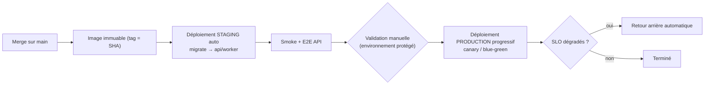

# 12 — DevOps, CI/CD, environnements, monitoring

Couvre les points 20 et 22.

---

## 1. Environnements

|                         | DEVELOPMENT                                                                 | STAGING                                                             | PRODUCTION                         |
| ----------------------- | --------------------------------------------------------------------------- | ------------------------------------------------------------------- | ---------------------------------- |
| Infra                   | `docker compose` local (PG+PostGIS, Redis, MinIO, Mailpit, collecteur OTel) | Réplique de prod (dimensionnement réduit), IaC                      | IaC, multi-AZ, sauvegardes, WAF    |
| Données                 | Fabriques/seeds démo                                                        | **Anonymisées** ou synthétiques ; **jamais** de copie brute de prod | Réelles                            |
| Comptes cloud / projets | Local                                                                       | **Compte/projet séparé**                                            | **Compte/projet séparé**           |
| PSP / SMS / LLM         | Sandbox / faux locaux                                                       | **Sandbox** des fournisseurs                                        | Clés de production                 |
| Firebase                | Projet dev                                                                  | Projet staging                                                      | Projet prod                        |
| Secrets                 | `.env.local` non commité (exemple `.env.example`)                           | Gestionnaire de secrets                                             | Gestionnaire de secrets + rotation |
| App mobile              | Flavor `dev` (`com.thy.app.dev`)                                            | Flavor `staging` (`.staging`)                                       | Flavor `prod`                      |
| Accès                   | Développeurs                                                                | Équipe                                                              | Accès minimal, temporaire, audité  |

Les 3 flavors mobiles ont des **identifiants d'application différents** (installables côte à côte) et des configurations Firebase distinctes. Le démarrage du backend **refuse** une configuration incohérente (ex. `SandboxProvider` en prod, credentials de prod hors prod).

## 2. Infrastructure (recommandation, ADR-012)

- **Conteneurs managés** (AWS ECS Fargate ou GCP Cloud Run) : services `api` et `worker` ; job `migrate` ; **PostgreSQL managé** (PostGIS, PITR, réplica plus tard) ; **Redis managé** (persistance, `noeviction` pour les files) ; stockage objet compatible S3 ; CDN + WAF ; gestionnaire de secrets ; registre d'images.
- **IaC** OpenTofu/Terraform, modules par environnement, revue de plan en PR ; **aucune modification manuelle** de production.
- **Région** : UE par défaut sous réserve de **mesure de latence réelle** depuis des réseaux mobiles locaux et de la **résidence des données** applicable.
- **Réseau** : sous-réseaux privés pour DB/Redis ; accès admin par bastion/VPN/identité ; egress contrôlé.
- **Coût** : budgets et alertes de dépense cloud/SMS/LLM dès le jour 1.
- **Poste Windows** : Docker Desktop (WSL2) pour le dev local ; **builds iOS via CI macOS** (GitHub Actions macOS ou Codemagic) ; JDK/Android SDK à installer en Phase 0.

## 3. CI/CD

### 3.1 Pipeline sur Pull Request

```mermaid
flowchart LR
  A["Push / PR"] --> B["Lint + format<br/>ESLint · dart analyze/format"]
  B --> C["Typecheck"]
  C --> D["Tests unitaires + propriétés"]
  D --> E["Intégration (Testcontainers)<br/>+ tests RLS / autorisation"]
  E --> F["Migration : dry-run + lint de schéma"]
  F --> G["Contrat : OpenAPI diff · événements"]
  G --> H["Sécurité : SAST · dépendances · secrets · SBOM"]
  H --> I["Build : image conteneur · APK/AAB debug · admin"]
  I --> J["Scan de conteneur"]
```

Filtres par chemin (`backend/**`, `mobile/**`, `admin/**`) et cache (Turborepo, pub cache) pour rester < 15 min.

### 3.2 Déploiement

- **« Aucune modification critique déployée sans validation »** : environnement `production` protégé (approbateurs requis), branche `main` protégée, revues obligatoires, CODEOWNERS pour `payments/auth/rbac/migrations/infra`.
- **Migrations** : job `migrate` **avant** le déploiement des applications ; **expand/contract** ; pas de _down_ en prod (roll-forward) ; migrations lourdes en plusieurs étapes.
- **Déploiement ≠ release** : les fonctionnalités partent derrière des **feature flags** ; les _kill-switches_ couvrent paiement, IA, SMS, modules.
- **Mobile** : Fastlane/Codemagic ; **déploiement progressif** (Play Console par pourcentage, TestFlight) ; `min_supported_version` côté serveur ; symboles de debug uploadés vers Sentry ; clés de signature dans un coffre.
- **Admin** : build statique, cache CDN invalidé, versions conservées pour retour arrière.
- **Versionnement** : Conventional Commits → changelog et versions automatisés.

## 4. Exploitation

| Sujet                  | Pratique                                                                    |
| ---------------------- | --------------------------------------------------------------------------- |
| Astreinte              | Rotation dès la sortie du jalon « bêta privée » ; niveaux de sévérité S1–S4 |
| Runbooks               | Un par alerte ; liés aux alertes                                            |
| Post-mortems           | Sans blâme, actions suivies                                                 |
| Capacité               | Revue mensuelle (DB, Redis, files, coûts)                                   |
| Changements de données | Scripts revus, idempotents, journalisés, jamais depuis un poste sans trace  |
| Reprise après sinistre | Exercice annuel, restauration testée trimestriellement                      |

---

## 5. Monitoring et observabilité (point 22)

### 5.1 Piliers

| Pilier               | Outil proposé (ADR-017)                 | Détail                                                                            |
| -------------------- | --------------------------------------- | --------------------------------------------------------------------------------- |
| **Erreurs & crashs** | Sentry (API, worker, admin, Flutter)    | Regroupement, releases, symboles, _breadcrumbs_ expurgés                          |
| **Traces**           | OpenTelemetry → Tempo/Grafana           | Une trace de bout en bout : mobile → API → DB/Redis → worker → PSP/LLM            |
| **Métriques**        | OpenTelemetry/Prometheus → Grafana      | RED (Rate/Errors/Duration) par route ; USE pour DB/Redis/files ; métriques métier |
| **Logs**             | pino JSON → Loki (ou équivalent managé) | `request_id`, `trace_id`, `business_id`, sans PII ; rétention 30–90 j             |
| **Disponibilité**    | Sondes externes + synthétiques          | `/health/live`, `/health/ready`, parcours OTP/checkout en staging                 |
| **Mobile**           | Sentry + Crashlytics optionnel          | Démarrage à froid, ANR, réseau, taille de file de sync                            |
| **Produit**          | PostHog (avec consentement)             | Entonnoirs, rétention, usage par module                                           |

### 5.2 Objectifs de niveau de service (indicatifs, à valider)

| SLI                                                     | SLO                       |
| ------------------------------------------------------- | ------------------------- |
| Disponibilité API (mensuelle)                           | 99,9 %                    |
| Latence API lecture (hors réseau)                       | p95 < 400 ms, p99 < 1,5 s |
| Écriture critique (vente, commande)                     | p95 < 600 ms              |
| Retard de l'outbox                                      | p95 < 5 s                 |
| Délai webhook → paiement confirmé                       | p95 < 30 s                |
| Livraison de notification push                          | p95 < 10 s                |
| Taux de succès des opérations de sync sans intervention | ≥ 99,5 %                  |
| Sessions sans crash (mobile)                            | ≥ 99,5 %                  |
| IA : 1ᵉʳ token                                          | p95 < 3 s                 |

### 5.3 Alertes prioritaires (celles demandées par le brief)

| Domaine             | Alerte                                                                                                         | Sévérité |
| ------------------- | -------------------------------------------------------------------------------------------------------------- | -------- |
| **API lente**       | Burn-rate du SLO de latence/erreurs (fenêtres multiples)                                                       | S2       |
| **Paiements**       | Taux d'échec/expiration anormal ; webhook non traité > N min ; **divergence de réconciliation** ; écart ledger | **S1**   |
| **Synchronisation** | Taux de `REJECTED`/`CONFLICT` en hausse ; opérations en attente très anciennes ; échec de pull                 | S2       |
| **Crash mobile**    | Chute du taux « crash-free » après release ; ANR                                                               | S2       |
| **IA**              | Latence, erreurs fournisseur, échecs de validation, **dépense** anormale, taux de refus                        | S2/S3    |
| **Files**           | DLQ non vide ; âge du plus vieil élément ; retard de l'outbox                                                  | S2       |
| **Sécurité**        | Pic d'échecs OTP/login, création massive de comptes, accès admin atypique, hausse de coûts SMS                 | S1/S2    |
| **Infra**           | Saturation DB (connexions, IO), mémoire Redis/éviction, disque, erreurs 5xx                                    | S1/S2    |
| **Coûts**           | Dépassement de budget cloud/SMS/LLM                                                                            | S3       |

Règles : alertes **sur les symptômes** (impact utilisateur) plutôt que sur les causes ; **chaque alerte a un runbook** ; pas d'alerte sans action possible.

### 5.4 Tableaux de bord

1. **Santé plateforme** (RED, DB, Redis, files, outbox).
2. **Paiements** (funnel initié → confirmé, latence PSP, échecs par cause, réconciliation).
3. **Sync** (opérations, conflits, âge de file, tailles de lots).
4. **Mobile** (crash-free, démarrage, réseau, versions actives).
5. **IA** (latence, coût, refus, validations échouées, outils).
6. **Notifications** (délivrance par canal/fournisseur, coût SMS).
7. **Métier** (ventes, commandes, inscriptions, rétention, usage par module).

### 5.5 Analytics et vie privée

Événements **pseudonymisés** sans PII ; consentement respecté ; rétention limitée ; séparation entre **rapports Business** (calculés depuis la base opérationnelle, pour le commerçant) et **analytics produit** (interne, agrégé). Les événements analytics d'origine serveur proviennent de l'**outbox** (fiables) ; le client n'envoie que l'usage d'UI.
